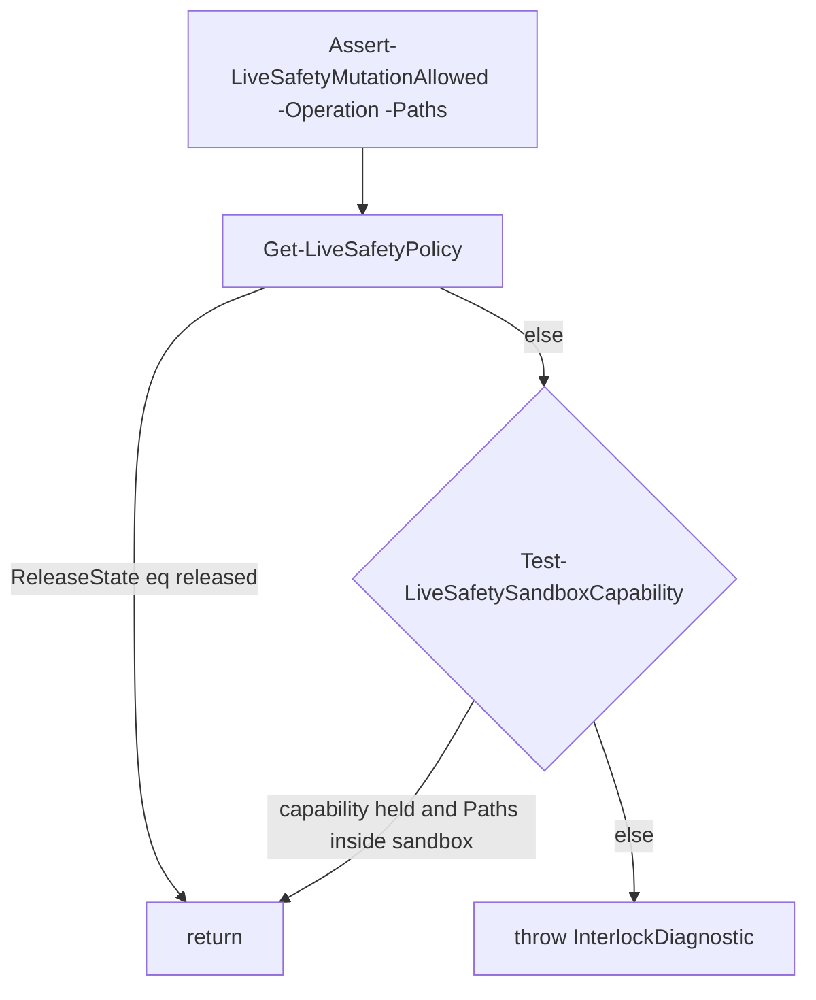
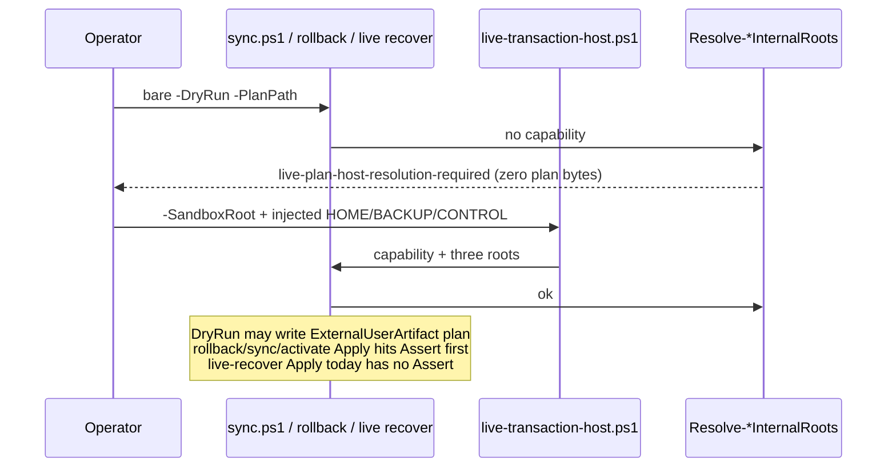
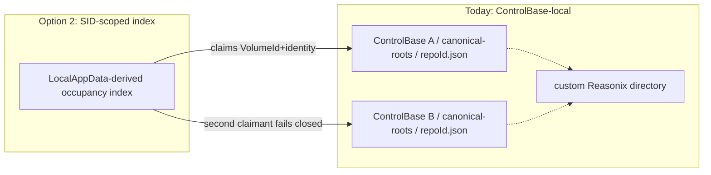

# Phase 4: Schema/CI Contract and Safe Release

> **Draft proposal (2026-09-16) — neither a decision nor an authorization.** This is the Phase 4
> decision package that pending items 1-2 of
> [`status/active/live-safety-hardening.md`](../../status/active/live-safety-hardening.md) ask for.
> It was written by an external model (grok-4.6) in an isolated `git worktree` at `71b8e74` and is
> published here unedited; its claims are the proposal's own analysis, not repository evidence,
> until the owner adopts or rejects the decisions in §7. It changes nothing: no policy byte, no
> interlock, no live root. Two gaps it records were closed in the same window — the parse gate now
> has an in-repo regression suite (`2a90261`, §2/§1.10) and the duplicated `Get-SkillDirectories`
> no longer hides one name from the gate's unknown-parameter pass (`fc6e173`); five other colliding
> names remain skipped, as its §1.10 describes.

| Field | Value |
|---|---|
| Status | Draft / decision-ready |
| Date | 2026-09-16 |
| Author | design proposal (uncommitted, worktree `wt-p4` @ `71b8e74`) |
| Tree | detached `71b8e745850849e75db079e41468604af05c6f3c` (`docs(live-safety): apply the four parallel review findings to the records`) |
| Policy today | `ProtocolVersion=3`, `ReleaseState=interlocked`, `InterlockDiagnostic=safety-protocol-upgrade-required` |
| Scope | Analysis and writing only. No tracked edits. No production `-Apply`. No interlock mutation. |

This proposal is the decision package for the only open roadmap item: Phase 4. An owner can approve, reject, or send it back with named decisions from §7. It reconciles the 2026-08-09 execution plan against the tree at `71b8e74`. Where that plan is stale, this document says so with evidence.

**Verification method.** Claims marked **verified** were read from files or produced by cheap read-only commands in this worktree (git metadata, `Import-PowerShellDataFile`, `Test-Path -PathType Leaf`, file counts). Claims marked **record** are STATUS / `status/active/live-safety-hardening.md` / plan prose that this session did not re-execute. The 39-suite `run-tests.ps1 -All` was **not** run.

---

## Overview

Phases 0–3 have landed a protocol-v3 live-safety stack whose production mutation entries remain interlocked. The remaining work is not “flip a flag.” It is to freeze the artifact/CI contract that Phases 1–3 actually emit, close the gaps that would let a green local `-All` hide a disabled parse gate or an unregistered schema, decide the cross-authority claim-store residual, then — and only then — create one reviewed `ReleaseState=released` commit and prove it under disposable OS identities.

Flipping `ReleaseState` is a protocol switch, not Apply authorization. After release, every Apply still needs an external reviewed `PlanPath`, the existing revalidation chain, and a later explicit owner authorization. Hooks and bootstrap stay preview/event-only. The secret scan, `.system` no-write rule, and production interlock mechanism are not weakened.

The 2026-08-09 Phase 4 plan is the right *shape* (registry → emitters → orchestrator → policy tests → docs → Reasonix tracking → interlocked candidate → released candidate → real-machine DryRun stop). It is the wrong *inventory* in several places: Task 6 assumed four tracked Reasonix files that this worktree no longer has; Task 8 “change only `ReleaseState`” does not ungate hard-coded `canonical-apply-interlocked` (there is **no** production Apply engine behind that exit 75); public sync/rollback/live-recover host resolution is sandbox-only; public `backup.ps1` no longer dies at the interlock diagnostic the records still quote. `Assert` returning is not Apply.

---

## Goals & Non-Goals

**Goals**

1. Make “schema/CI contract” a named, fail-closed bundle: registered ArtifactKinds, emitter self-validation, a repository-validation orchestrator that preserves every current non-suite gate, a policy suite including parse-gate regression, and docs that describe the *interlocked* post-Phase-3 contract without claiming released behavior.
2. Stage a reversible protocol release: Task 7 wires production engines + Assert-first live-recover + shared resolver while still interlocked; then `ReleaseState` `'interlocked'` → `'released'` in `scripts/live-safety-policy.psd1` **only** (no STATUS in that commit), after Task 7-class gates, as a separately authorized commit, proved on disposable identities. `Assert` returning is not Apply.
3. Decide the cross-authority claim store (build SID-scoped occupancy, or accept residual risk in writing) *before* flipping `ReleaseState` if custom Reasonix roots will be used on a machine that might grow a second ControlBase.
4. Collect real-machine read-only + create-new DryRun evidence and **stop before Apply**.

**Non-Goals**

- No production Apply, rollback Apply, retirement Apply, live backup mutation, or `sync.ps1 -Apply`.
- No weakening, bypass, or whitelist of `scripts/scan-secrets.ps1`, the interlock, or `.system` / unknown-skill no-write rules.
- No Git push, merge, history rewrite, or force-push. Pending item 8 (privacy narrative) is owner-only.
- No new external dependencies beyond pinned `tools/gitleaks` and `tools/schema-validator`.
- No dirty policy edit, no CLI/env bypass, no treating sandbox tests as production.
- Config-pull `-Apply` and project-profile `-Apply` are not this release unit (see §1 classification).

---

## 1. Current state, precisely (with file:line evidence)

### 1.1 Policy bytes (verified)

`scripts/live-safety-policy.psd1` is exactly:

```powershell
@{
    SchemaVersion = 1
    ProtocolVersion = 3
    ReleaseState = 'interlocked'
    InterlockDiagnostic = 'safety-protocol-upgrade-required'
}
```

`Get-LiveSafetyPolicy` (`scripts/live-safety-interlock.ps1:5-18`) throws `safety-protocol-upgrade-required` if the file is missing, `ProtocolVersion` is not 3, `ReleaseState` is not `interlocked|released`, or `InterlockDiagnostic` is blank.

`Assert-LiveSafetyMutationAllowed` (`scripts/live-safety-interlock.ps1:96-107`):

1. If `ReleaseState -eq 'released'` → **return** (line 104).
2. Else if `Test-LiveSafetySandboxCapability -Paths $Paths` → **return** (line 105). Capability requires a dedicated OS-temp descendant, a held capability file whose bytes match `AI_AGENT_DOTFILES_INTERNAL_CAPABILITY_TOKEN`, and every mutation path inside that sandbox (`:58-94`).
3. Else **throw** `"$($policy.InterlockDiagnostic): ProtocolVersion=... ReleaseState=...; production mutation '$Operation' is unavailable..."`.

Sandbox capability is created only by `New-LiveSafetySandboxCapability` and injected by `scripts/internal/live-transaction-host.ps1:23-42` (`AI_AGENT_DOTFILES_INTERNAL_{SANDBOX_ROOT,CAPABILITY_PATH,CAPABILITY_TOKEN,HOME_ROOT,BACKUP_ROOT,CONTROL_BASE}`).



### 1.2 Call sites that invoke the interlock (verified)

| Entry | File:line | Fires when | Public result today (interlocked, no sandbox) |
|---|---|---|---|
| `sync.ps1` | `:824-827` | **only `-Apply`** | `safety-protocol-upgrade-required` (operation `sync` or `retirement-sync`) |
| `activate-harness-env.ps1` | `:139-150` | **only `-Apply`** | same (operation `environment-activate`) |
| `task-skills.ps1` | `:139-148` | **only `-Apply`** | same (operation `task-$Action`) |
| `rollback-harness-env.ps1` | `:582-585` | **only `-Apply`** | same (operation `environment-rollback`) |
| `authority-harness-env.ps1` | `:199-206` | **only `-Apply`** | same (operation `authority-$Action`) |
| `backup.ps1` | `:61-70` | **not first** | see §1.3 |

`tests/automation-safety.tests.ps1:21-32` pins **exactly** these Apply cases to `safety-protocol-upgrade-required` before production work: `sync.ps1 -Apply`, retirement `sync.ps1 -Apply -RetireManifestPath`, `activate-harness-env.ps1 -Apply` (Name/HomeRoot/BackupRoot, **no** `-ControlBase` and **no** `-PlanPath`), three `task-skills.ps1 -Apply` variants (ensure-skill / sync `-Automatic` / close; same incomplete trio, no PlanPath), and `rollback-harness-env.ps1 -Apply`. It does **not** cover `authority-harness-env.ps1 -Apply` (Task 4 adds that). Activate/task cases in that suite only prove the interlock token, not root-selection or plan gates. A sandbox Apply whose paths escape the sandbox also matches the interlock token (`:45-51`).

### 1.3 `backup.ps1` — public surface is *not* the interlock (verified; record is stale)

Public standalone backup **does not** stop with `safety-protocol-upgrade-required` unless the internal sandbox capability is already present.

```61:70:scripts/backup.ps1
if (-not (Test-LiveSafetySandboxCapability)) {
    # The public standalone entry is retired (Phase 2 Task 3): zero writes,
    # non-zero diagnostic, before any traversal or BackupRoot work.
    Write-Host 'backup-is-transaction-internal: managed backups are created by the live transaction host from a bound ReceiptIntent.'
    Write-Host 'The reviewed plan carries the managed backup preview; public standalone snapshots are no longer produced.'
    exit 1
}
if (-not $DryRun) {
    Assert-LiveSafetyMutationAllowed -Operation 'standalone-backup' -Paths @($RepoRoot, $HomeRoot, $BackupRoot, $ReasonixLiveSkillsPath)
}
```

So:

- Public `backup.ps1` (with or without `-DryRun`) → `backup-is-transaction-internal`, exit 1, **before** the interlock. `tests/automation-safety.tests.ps1:40` asserts this.
- Only a sandbox-capable invocation reaches `Assert-LiveSafetyMutationAllowed`, and then only when **not** `-DryRun`.

STATUS Purpose (`STATUS.md:47-48`) still says “standalone backup … stop with `safety-protocol-upgrade-required`”. Pending item 1 (`status/active/live-safety-hardening.md:2728-2729`) repeats it. `docs/README.md:75` already documents `backup-is-transaction-internal`. `docs/README.md:254-258` still tells the operator that non-DryRun backup returns `safety-protocol-upgrade-required` and that `backup.ps1 -DryRun` is a valid public preview — both contradicted by `:61-67`.

Managed snapshots are transaction-internal (`scripts/backup-receipt-common.ps1`). The comment at `backup.ps1:14-22` records a sandbox-internal legacy snapshot bridge for the env-activation content-aware route until a later Task 5 cleanup; that bridge is not a public CLI.

### 1.4 Other mutation-shaped entries — classification (verified)

| Entry | Classification | Evidence |
|---|---|---|
| Canonical setup/normalize/promote/merge **Apply** | **Hard stop after revalidation — no production engine** | `scripts/canonical-transaction.ps1:34-71` revalidates the plan, optionally takes locks, then **always** emits `canonical-apply-interlocked`, writes a FAIL result, and `exit 75`. There is no subsequent production orchestrator call. Independent of `ReleaseState`. `tests/canonical-transaction-apply.tests.ps1:25-28` asserts production common does **not** expose `Invoke-CanonicalReviewedSkillTransaction`, production lock has no `InternalWaitSeconds`, and `Invoke-SealedCanonicalReviewedSkillTransaction` is defined only in `tests/helpers/canonical-reviewed-transaction-engine.ps1` with **no** failpoint provider. Setup kill/failpoint host: `tests/helpers/canonical-setup-kill-host.ps1`. Public CLI `scripts/setup-canonical-transaction.ps1:40-54` forwards `-Apply` into that hard stop. |
| Canonical recover Apply | **Hard stop after revalidation — no production engine** | `scripts/recover-canonical-transaction.ps1:119-122`: `canonical-recovery-apply-interlocked`, exit 75. Sealed engine: `tests/helpers/canonical-reviewed-recovery-engine.ps1` `Invoke-SealedCanonicalReviewedRecovery`. |
| Live recover DryRun | **Sandbox host-resolution**, plan-only | `Resolve-LiveRecoveryInternalRoots` (`:74-92`, `:555-560`) throws `live-plan-host-resolution-required` unless sandbox + three injected roots. DryRun writes ArtifactKind `rollback-plan` at `:640-662` with **no** schema validation. **No Assert.** |
| Live recover Apply | **Sandbox host-resolution, then real mutation, no Assert** | Same resolver, then semantics-only plan check (`:668-669`), then journal `RECOVERY_ACTION_INTENT` and sealed recovery primitives (`:665-710+`). **No `Assert-LiveSafetyMutationAllowed`.** A released-only resolver without adding Assert would ungate this surface. Status with explicit `-ControlBase` is read-only and skips the resolver (`:540-553`). |
| `config-pull.ps1 -Apply` | **Separately gated live-home config mutation** (Claude/Codex config, not skills). Not behind the live-safety interlock. Secret-scan-then-copy (`:179-203`). Docs: not part of env activation (`docs/README.md:572-574`, `CLAUDE.md` hard rules). **Not this release unit.** |
| `apply-harness-profile.ps1 -Apply` | **Not a live-home mutation** | Writes allowlisted project-local outputs; `Assert-NoHarnessHomeTarget` (`scripts/apply-harness-profile.ps1:32`). Explicit exception in `docs/README.md:5-7`. |
| `setup.ps1 -ApproveRunner` | **Not live mutation** | Pins Git-private runner + preview route table (`scripts/setup.ps1:17-48`). No Apply. |
| Bootstrap / Git hooks | **Preview/event-only** | `scripts/auto-sync-after-git.ps1:344` manual/Force → `safety-protocol-upgrade-required` code 73. Hooks never Apply. |

### 1.5 What is reachable today without flipping `ReleaseState` (verified)

**Already permitted (no interlock, no sandbox required):**

| Surface | Command that exists today |
|---|---|
| Doctor | `pwsh -NoProfile -File scripts/doctor.ps1` (CI uses `-HomeRoot $isolatedHome -SkipSecretsScan`) |
| Hook inspection | `pwsh -NoProfile -File scripts/check-hooks.ps1` |
| Parse gate | `pwsh -NoProfile -File scripts/check-powershell-syntax.ps1` |
| Secret scan | `pwsh -NoProfile -File scripts/scan-secrets.ps1` |
| Build skills | `pwsh -NoProfile -File scripts/build-skills.ps1` |
| Artifact registry | `pwsh -NoProfile -File scripts/validate-json-artifacts.ps1 -All -JsonSummaryPath <external create-new>` |
| Unified suites | `pwsh -NoProfile -File scripts/run-tests.ps1 -All -JsonSummaryPath <external create-new>` |
| Env list | `pwsh -NoProfile -File scripts/agent-dotfiles.ps1 env list` → `list-harness-env.ps1` (writes nothing; `:17`) |
| Env status | `pwsh -NoProfile -File scripts/agent-dotfiles.ps1 env status` → `status-harness-env.ps1` (writes nothing; `:22`) |
| Env build (staging only) | `pwsh -NoProfile -File scripts/agent-dotfiles.ps1 env build -Name work` → `build-harness-env.ps1` writes `envs/<name>/` only |
| Env authority **status** | `pwsh -NoProfile -File scripts/agent-dotfiles.ps1 env authority status` (refuses DryRun/Apply; `:160-186`) |
| Env task **status** | `task-skills.ps1 -Action status` — overlay report always; authority baseline wrapped in try/catch (`:745-778`) |
| Canonical **status** | `pwsh -NoProfile -File scripts/agent-dotfiles.ps1 canonical status` |
| Canonical recover **status** | `... canonical recover status` (repo-local, no sandbox) |
| Config status | `... config status` |
| Pinned tool verify | `scripts/install-schema-validator.ps1 -VerifyOnly`, `scripts/install-gitleaks.ps1 -VerifyOnly` |

Phase 4 plan Task 9 Step 1 (`docs/superpowers/plans/2026-08-09-live-safety-phase-4-validation-release.md:305-307`) lists this read-only set. **Caveat (verified):** `live recover status` *without* `-ControlBase` calls `Resolve-LiveRecoveryInternalRoots` and therefore needs the sandbox host today. **Owner decision (recommended, §7.11):** keep **status-only** `-ControlBase` forever so a real machine can scan without sandbox; **forbid** `-ControlBase` / `-HomeRoot` / `-BackupRoot` on live-recover DryRun/Apply; do not add those selectors to public sync/rollback mutation CLIs.

**DryRun — where it actually runs (verified):**

`sync.ps1` **always** calls `Resolve-LiveSyncInternalRoots` (`:836`) *after* the Apply-only interlock. That helper (`scripts/live-plan-evidence-common.ps1:42-57`) throws `live-plan-host-resolution-required` unless sandbox capability **and** all three of `AI_AGENT_DOTFILES_INTERNAL_{HOME_ROOT,BACKUP_ROOT,CONTROL_BASE}` are set. It never reads `USERPROFILE`.

The host invocation that exists today is `docs/README.md` §4 (`:126-140`):

```powershell
$sandbox = Join-Path ([System.IO.Path]::GetTempPath()) "ai-agent-dotfiles-sync-sandbox-$([Guid]::NewGuid().ToString('N'))"
New-Item -ItemType Directory -Path $sandbox | Out-Null
$plan = Join-Path $sandbox 'sync-plan.json'
& pwsh -NoProfile -File scripts/internal/live-transaction-host.ps1 `
    -SandboxRoot $sandbox `
    -ScriptPath (Join-Path (Get-Location) 'scripts/sync.ps1') `
    -ArgumentsBase64 ([Convert]::ToBase64String([System.Text.Encoding]::UTF8.GetBytes(
        (ConvertTo-Json @('-SkipBuild','-SkipSecretScan','-DryRun','-PlanPath',$plan) -Compress))))
```

A bare `pwsh -NoProfile -File scripts/sync.ps1 -DryRun` (or `agent-dotfiles.ps1 sync -DryRun`) against real `USERPROFILE` is **not** a production DryRun; `tests/sync.tests.ps1:196` asserts `live-plan-host-resolution-required`. `docs/README.md:280-285` still shows that bare shape — stale.

Other DryRun surfaces:

| Surface | PlanPath | Root resolution |
|---|---|---|
| `activate-harness-env.ps1 -DryRun` | **required** (`:153-155`, token `activation-plan-path-required`) | **Complete** `-HomeRoot/-ControlBase/-BackupRoot` trio **or** none (sandbox inject). Partial trio → `activation-root-selection-incomplete` (`:171-191`) |
| `task-skills.ps1` ensure/sync/close `-DryRun` | required | Same complete-or-none as activate (`:223-243`; the overlay token ends `-root-selection-incomplete`) |
| `authority-harness-env.ps1 -DryRun` | **required** (`:110`) | **Not** the same gate. `Initialize-AuthoritySandboxContext` (`:118-128`): if **any** of the three is missing, overwrite **all three** from `Resolve-LiveSyncInternalRoots`. A partial trio is not an error; it is ignored. After a released resolver, a partial trio would silently take identity-derived roots unless Task 7 makes authority match activate’s complete-or-none (recommended, §7.12). |
| `rollback-harness-env.ps1 -DryRun` | **required** (`:31-35`) | Sandbox-only `Resolve-RollbackInternalRoots` (`:78-96`). Public DryRun → `live-plan-host-resolution-required` (`tests/harness-env.tests.ps1:961-963`). **Apply** does **not** use this as first refusal — see §1.6. |
| Canonical setup `-DryRun` | required | `Get-CanonicalPrivateRootSelection` (`canonical-transaction-common.ps1:1090-1113`) using `[Environment]::GetFolderPath(LocalApplicationData)`, **not** `Get-WindowsHomeAuthorityIdentity`. Reachable without sandbox. Locator alignment is Task 7. |
| Live recover `-DryRun` | required | Sandbox-only resolver. Plan-only; no Assert. |



### 1.6 Rollback reachability (verified + record)

Phase 3 G4 (`976d0fe`, **record** in pending item 1) made the rollback **entry reachable**: `scripts/rollback-harness-env.ps1` exists, CLI-routed, `-ReceiptPath` + `-PlanPath` mandatory.

Split DryRun vs Apply. Order in `rollback-harness-env.ps1`:

1. **Apply first refusal is the interlock.** If `$Apply`, `Assert-LiveSafetyMutationAllowed` runs at `:582-585` **before** `Resolve-RollbackInternalRoots` (`:588`). On a real home with no sandbox capability, public Apply throws `safety-protocol-upgrade-required` and **never** reaches host resolution. Pending item 1’s “refusal at Apply is the interlock itself” is the accurate Apply statement.
2. **DryRun first refusal is host resolution.** DryRun skips Assert and dies at `live-plan-host-resolution-required` (`tests/harness-env.tests.ps1:961-963`).
3. **With sandbox roots**, Assert **returns** (capability path) and Apply proceeds into Resolve — that is the test path, not a public real-home path.

After Task 7, Apply still Asserts first; Resolve runs only if Assert returned (sandbox today; sandbox-wins or released identity later).

`docs/RESTORE.md:1-60` documents the future Apply contract and states production rollback currently returns `safety-protocol-upgrade-required`. Scope: current managed Claude/Codex/Reasonix skills + environment state; never unknown skills, `.system`, credentials, sessions, caches, or Codex `config.toml`.

### 1.7 CI: `.github/workflows/validate.yml` (verified)

Job `validate`, `runs-on: windows-latest`, **`timeout-minutes: 460`** (`:15`). Steps have **no** per-step `timeout-minutes`. Order:

| # | Step name | Notes |
|---|---|---|
| 1 | Checkout | `actions/checkout@v5` |
| 2 | Show PowerShell version | |
| 3 | Install and verify pinned JSON Schema validator | install then `-VerifyOnly` |
| 4 | Install and verify pinned gitleaks | install then `-VerifyOnly` |
| 5 | Validate registered JSON artifacts | `validate-json-artifacts.ps1 -All -JsonSummaryPath $RUNNER_TEMP\...` |
| 6 | Run repository doctor | **isolated HOME** under `$env:RUNNER_TEMP\ai-agent-dotfiles-doctor-home`; **`-SkipSecretsScan`** (`:57-63`) |
| 7 | Scan for secrets | separate step; requires JSON `Result=PASS` |
| 8 | Build generated skills | `build-skills.ps1` |
| 9 | Verify build leaves Git clean | four literal Reasonix negative pathspecs (`:105-111`); generated trees must be untracked |
| 10 | Validate machine-readable schemas and build evidence | `ConvertFrom-Json` existence check on 10 schema files (including three **unregistered** ones); then `build-harness-env.ps1 -Name work`, list, status |
| 11 | Parse every current-worktree PowerShell file | `check-powershell-syntax.ps1` |
| 12 | Run every root regression suite exactly once | `run-tests.ps1 -All -JsonSummaryPath ...` |
| 13 | Reject dangerous tracked files | pem/key/p12/pfx, `.env`, tokens, backup paths, `.ssh` |

There is **no** `scripts/run-repository-validation.ps1`. Non-suite gates are inlined in YAML. **Step 10 is a required named non-suite gate** (schema-file existence + `build-harness-env.ps1 -Name work` + list + status). Task 3 must keep it. Step 5 `validate-json-artifacts.ps1 -All` remains exactly-once (may move in the orchestrator order, not deleted).

### 1.8 Artifact registry (verified)

`schemas/artifact-contracts.psd1`: **31** contracts, each with one positive fixture, **133** negative fixtures total. Matches STATUS “31/31/133”.

`schemas/*.schema.json` count: **34**. Unregistered (exist on disk, not in `Contracts`):

- `doctor-report.schema.json`
- `harness-component.schema.json`
- `harness-platform-output.schema.json`

`run-report.schema.json` is registered as ArtifactKind `canonical-build-result`. `secret-scan.schema.json` is registered as `canonical-secret-scan-result`. Design §4.6 lists doctor/secret/run reports as in-scope; doctor is the gap.

`tests/fixtures/artifacts/*.json` count: **165** = 31 positives + 133 negatives + **one nested payload**. The extra file is `tests/fixtures/artifacts/manifest-target.json` (`{"fixture":"manifest-target","version":1}`), referenced as `Path` inside `artifact-validation-manifest.valid.json` and the tampered negative. It is **not** an orphaned contract. Completeness tests must allow listed-path references inside registered fixtures; they must **not** require every JSON leaf under `tests/fixtures/artifacts/` to be a contract row.

`schemas/repository-validation-summary.schema.json` **does not exist**.

### 1.9 Test runner budget (verified; computed this session)

`tests/*.tests.ps1` count: **39**. `scripts/run-tests.ps1` discovers all of them; it **never** invokes `check-powershell-syntax.ps1` (pending item 12).

`tests/test-timeouts.psd1`: `DefaultTimeoutSeconds=120`, `SetupAndNonSuiteBudgetSeconds=300`, `MarginSeconds=120`.

Formula (`scripts/test-runner-common.ps1:232, 241`):

`RequiredJobTimeoutSeconds = SetupAndNonSuiteBudgetSeconds + sum(Suite.TimeoutSeconds) + MarginSeconds`

This session: suite-timeout sum **25365**, required **25785** seconds (429.75 min). Workflow `460 * 60 = 27600`. Difference **1815** seconds (30.25 min). `tests/test-runner.tests.ps1:149-153` asserts `workflowSeconds -gt requiredSeconds`.

Eleven suites use the 120 s default (not listed in `Suites`): `approved-runner-exact-byte`, `automation-safety`, `canonical-preflight`, `json-artifact-exact-byte`, `json-canonicalization`, `path-safety`, `private-path-boundary`, `safe-tree-walker`, `scan-input-boundary`, `schema-validation`, `transaction-journal-exact-byte`.

Largest overrides: `canonical-hard-kill` 5400, `root-claims-registry` 3600, `canonical-transaction-apply` 1800, `canonical-recovery` / `skills-import` / `sync` 1200.

### 1.10 Parse gate (verified)

`scripts/check-powershell-syntax.ps1` is CI step 11. Operator-as-parameter check sits in a vestigial `if ($true)` (`:89`). Exemption table is empty (`:25`). Tracked `*.ps1/*.psm1/*.psd1` count this session: **171** (matches the 171-file parse-gate **record**). `run-tests.ps1` never calls it. Pending item 12 is accurate.

### 1.11 Phase 4 planned files that do **not** exist (verified)

| Path | Exists |
|---|---|
| `scripts/run-repository-validation.ps1` | False |
| `tests/repository-validation.tests.ps1` | False |
| `tests/repository-policy.tests.ps1` | False |
| `scripts/untrack-private-paths.ps1` | False |
| `tests/private-index-removal.tests.ps1` | False |
| `schemas/repository-validation-summary.schema.json` | False |

### 1.12 Reasonix desktop-topic paths (metadata only; verified)

Commands used (no content open, no hash, no diff), four literals:

`.reasonix/desktop-topic-auto-title-meta.json`, `...-created-at.json`, `...-title-sources.json`, `...-titles.json`

| Probe | Result at `71b8e74` |
|---|---|
| `git ls-files --stage -- <four>` | empty (not in index) |
| `git ls-tree HEAD -- <four>` | empty (not in HEAD) |
| `Test-Path -PathType Leaf` | **False, False, False, False** |
| `git check-ignore -v --no-index -- <four>` | `.gitignore:59-62` four **anchored** rules |

`.gitignore:59-62` (verified):

```
/.reasonix/desktop-topic-auto-title-meta.json
/.reasonix/desktop-topic-created-at.json
/.reasonix/desktop-topic-title-sources.json
/.reasonix/desktop-topic-titles.json
```

Original Phase 4 Task 6 Expected (“Git lists exactly four tracked paths; all four local files exist”) is **stale here**. `Get-ProtectedReasonixRelativePaths` (`scripts/scan-input-common.ps1:176-186`) still names the same four literals for the no-read scan boundary.

### 1.13 Record statements this tree contradicts

Evaluated as requested, plus extras found while reading.

| # | Record | Tree at `71b8e74` | Kind |
|---|---|---|---|
| C1 | STATUS Purpose / pending item 1: standalone backup stops with `safety-protocol-upgrade-required` | `backup.ps1:61-67` public path is `backup-is-transaction-internal` before the interlock | **verified contradiction** |
| C2 | Phase 2 closeout “38/38” (`STATUS.md:3982`, live-safety Task 9) | 39 `tests/*.tests.ps1` | **verified**; 38 was true at that checkpoint (**record**) |
| C3 | Phase 2 “400-minute workflow bound” / “computed job requirement 23685 s” | `timeout-minutes: 460` (27600 s); current required **25785** s | **verified**; 400 min is a historical checkpoint |
| C4 | Phase 4 plan Task 6: four Reasonix files tracked and locally present | index empty, HEAD empty, `Test-Path` False | **verified stale plan** |
| C5 | STATUS / roadmap: “corrected privacy rewrite is published at `bbba28f`” | `git show -s bbba28f` → `chore(privacy): ignore local Reasonix desktop state`; `--stat` is `.gitignore +4` only | **verified**; pending item 8 already flags this |
| C6 | AGENTS.md / CLAUDE.md / docs still say “Phase 0” Apply stop | Apply interlock **is** still true for the five `Assert-LiveSafetyMutationAllowed` callers. Public DryRun/sync is sandbox-only (`live-plan-host-resolution-required`), which those banners under-specify | **partially stale docs** |
| C7 | STATUS.md:2844-2846 and pending item 8: `91e871e` “does not exist at all” / “unresolvable” | `git cat-file -t 91e871e` → `commit`; subject `feat(live-safety): add phase 2 authority registry foundations`; `merge-base --is-ancestor 91e871e HEAD` exit 0 | **verified contradiction of the later annotation** (the annotation itself is a 2026-09-16 record) |
| C8 | Phase 0 implementation SHA `0a6c16e` (live-safety-hardening.md:24, Phase 0 plan) | `git cat-file -t 0a6c16e` → `Not a valid object name` | **verified missing object**; consistent with a rewrite, not proof of what the rewrite was |
| C9 | `docs/README.md` §8: “backup 会**完整备份**它” (`.system`) | Receipt producer records `.system` **root-entry markers without traversal** (`STATUS.md` Phase 2 Task 3 closeout; `backup-receipt-common.ps1` design). Public backup does not run | **stale docs** |
| C10 | `docs/README.md` §10 bare `sync -DryRun -PlanPath $plan` | `Resolve-LiveSyncInternalRoots` fail-closed | **stale docs** |
| C11 | live-safety-hardening completed evidence: “four local user-owned files remain present and ignored” | this worktree `Test-Path` False | **environment-specific**; do not require presence here |
| C12 | Original Task 8: “Change only `ReleaseState`” then disposable-identity **Apply** of public canonical setup | `canonical-transaction.ps1` always `canonical-apply-interlocked` / 75 with **no production engine** behind it (`tests/canonical-transaction-apply.tests.ps1:25-28`). Public sync/rollback/live-recover still need sandbox roots. Live-recover Apply has no Assert. | **stale plan vs current code** — see §3(d) and Task 7. `Assert` returning is not Apply. |

Pending item 9 (superseded present-tense docs) and item 10 (CI must be read from workflow, not inferred from local `-All`) remain valid operational notes. This machine did not query `gh`.

---

## 2. What "schema/CI contract" must mean concretely here

### 2.1 Verdict

**No. The current 39-suite budget + parse gate + 31/133 artifact validation are not sufficient to flip `ReleaseState`.**

They are necessary regression evidence. They do not prove: orchestrated named-gate completeness, repository-validation-summary DAG, static “no public Apply bypass” policy, parse-gate regression (the gate is outside the runner), emitter fail-closed completeness, docs that match the post-Phase-3 interlocked contract, or the claim-store decision.

### 2.2 What already landed (do not re-litigate)

Phase 0 runner + `validate-json-artifacts.ps1` + pinned validator/gitleaks. Phase 1 canonical transactions. Phase 2 live plans/receipts/journals/host. Phase 3 shared authority, activation, task overlay, rollback entry, selection-aware preview routing. Registry already holds 31 kinds covering the live/canonical/env/authority artifacts those phases emit.

### 2.3 Gaps versus original Tasks 1–5 and 7 and design §§4.6, 5 Phase 4, 6.5, 7, 11

| Gap | Why it blocks release |
|---|---|
| Three unregistered schemas (`doctor-report`, `harness-component`, `harness-platform-output`) | Registry completeness test does not exist; CI step 10 only `ConvertFrom-Json`s them. Design §4.6 includes doctor/secret/run; doctor is in-scope and unregistered. The two harness-profile schemas are **out of** §4.6’s “不隐含扩大到 … project-profile” carve-out unless the owner registers them. |
| No `repository-validation-summary` | Design §4.6 last row; Task 1 Step 1; Task 3 orchestrator DAG. |
| No `run-repository-validation.ps1` | Task 3: one local/CI orchestrator with named non-suite gates exactly-once. Today YAML inlines gates; adding a suite must not drop any. |
| No `tests/repository-policy.tests.ps1` | Task 4: no public skip/test Apply, no hook Apply, no CLI/env bypass, Reasonix generated deny, retired MCP/OpenClaw banners. |
| Parse gate has no in-repo RED (pending item 12) | `if ($true)` can become an off switch; 39 suites stay green. |
| Emitter self-validate is **partial** | `Publish-ValidatedPreflightJson` (`canonical-preflight-common.ps1:33-72`) is the intended adapter. Canonical plans use it (`Write-CanonicalTransactionPlan:1418`). Receipts/journals/test-summary/runner artifacts validate. Gaps: **`Write-LiveSyncPlan` (`live-plan-common.ps1:732-743`)** (`ConvertTo-Json` + `WriteAllText`; authority DryRun uses it at `authority-harness-env.ps1:642`); **rollback DryRun** (`rollback-harness-env.ps1:689-699` semantics then `WriteAllText`; schema only on Apply `:709`); **live-recover DryRun** (`recover-live-transaction.ps1:640-662`, ArtifactKind `rollback-plan`, no schema); **live-recover Apply** semantics-only before mutate (`:668-669`); **`Write-DoctorJson` (`doctor.ps1:43-61`)** same unvalidated `WriteAllText`. `doctor-report.schema.json` has `additionalProperties: false` and **no** `ArtifactKind` field. Task 1 decides the doctor contract shape; Task 2 fills these gaps only. |
| Negative-sentinel density | Original Task 1 Step 4 asked wrong/missing version, unknown property, missing Reasonix, duplicate platform, bad order, malformed hash, forbidden null, remote `$ref`, plus plan/receipt/journal reference-graph cases. Several kinds still have a single `unknown-property` negative (`canonical-journal-header/record`, `canonical-root-claim`, `canonical-setup-state`, runner events, etc.). |
| No producer↔registry completeness test | Task 1 Step 5. |
| Docs still say Phase 0 / wrong backup token / bare sync DryRun / `.system` full backup | Pending item 9. Must describe the **interlocked** post-Phase-3 contract, not released behavior. |
| Claim-store decision | §4. Design §11 item 6 (single selection under overlapping roots) is **not** met across HomeAuthorities. |

### 2.4 Release evidence bundle (exact)

Produced **outside** the tracked tree (create-new paths). Do not commit.

1. `scripts/check-powershell-syntax.ps1` exit 0 (file count recorded; currently 171 tracked ps files).
2. `scripts/install-schema-validator.ps1 -VerifyOnly` and `scripts/install-gitleaks.ps1 -VerifyOnly` exit 0.
3. `scripts/build-skills.ps1` exit 0; Claude/Codex/Reasonix counts (last **record**: 7/15/7).
4. `scripts/scan-secrets.ps1 -JsonPath <external>` → `Result=PASS`.
5. `scripts/validate-json-artifacts.ps1 -All -JsonSummaryPath <external>` → contracts/positives/negatives with zero failures (today 31/31/133; after Task 1 the new counts).
6. `scripts/run-tests.ps1 -All -JsonSummaryPath <external create-new>` → `discovered=N; passed=N; failed=0; timed-out=0` with `RequiredJobTimeoutSeconds` **strictly less than** `timeout-minutes * 60`. After Task 3 this is invoked **once** by the orchestrator, not twice.
7. **Phase 4 would add:** `scripts/run-repository-validation.ps1 -OutputRoot $verify -ChildArtifactManifestPath ... -FinalArtifactManifestPath ... -JsonSummaryPath ...` → child manifest (`ManifestRole=children`) → repository-validation-summary → final manifest (`ManifestRole=final`) acyclic DAG; every named non-suite gate present; `git` porcelain clean under `.` plus the four Reasonix literal negative pathspecs.
8. Policy suite + parse-gate fixtures green.
9. Doctor on isolated HOME (as CI does).
10. SHA-256 of every external summary/manifest; ToolchainPolicyHash of the candidate commit; `ReleaseState` value of that commit.

Local `-All` does **not** stand in for GitHub `Validate` (pending item 10). Read the workflow; this machine has no `gh` auth.

---

## 3. The release procedure, staged

**Order relative to §4:** do **not** flip `ReleaseState` until the owner has either accepted claim-store residual risk in writing (option 1) or landed the SID-scoped store (option 2). Staging-lock rebuild (pending item 4) is artifact prep and never Apply.

### Stage (a) Read-only validation — **already permitted**

No owner authorization beyond “run the existing read-only CLIs.”

Commands that exist today:

```powershell
pwsh -NoProfile -File scripts/doctor.ps1
pwsh -NoProfile -File scripts/check-hooks.ps1
pwsh -NoProfile -File scripts/agent-dotfiles.ps1 config status
pwsh -NoProfile -File scripts/agent-dotfiles.ps1 env list
pwsh -NoProfile -File scripts/agent-dotfiles.ps1 env status
pwsh -NoProfile -File scripts/agent-dotfiles.ps1 env task status
pwsh -NoProfile -File scripts/agent-dotfiles.ps1 env authority status
pwsh -NoProfile -File scripts/agent-dotfiles.ps1 canonical status
pwsh -NoProfile -File scripts/agent-dotfiles.ps1 canonical recover status
# live recover status: status-only -ControlBase is kept (owner decision §7.11).
# Forbid that selector on DryRun/Apply. Bare status still needs sandbox until Task 7 resolver.
pwsh -NoProfile -File scripts/agent-dotfiles.ps1 live recover status -ControlBase <existing-control-base>
```

Evidence: doctor WARN on `ReleaseState=interlocked` (`doctor.ps1:319`); check-hooks prints protocol version/state (`check-hooks.ps1:55-56`); authority status prints one route (`authority-harness-env.ps1:170-185`).

Acceptance: every command exit 0 or a documented non-zero *status* token (`canonical-setup-required`, `manual-recovery-required`, unfinished journals). No plan files written except none.

Stop: unfinished canonical/live journals → recovery evidence only (stage b route selection). Protected `.reasonix` content is never opened.

Pending item 4 — rebuild stale `envs/` **before future environment planning** (does not authorize Apply):

```powershell
pwsh -NoProfile -File scripts/build-harness-env.ps1 -Name minimal
pwsh -NoProfile -File scripts/build-harness-env.ps1 -Name work
pwsh -NoProfile -File scripts/build-harness-env.ps1 -Name full
```

### Stage (b) External create-new DryRun with a reviewed plan — **permitted as DryRun; owner reviews the plan**

**Do not** recommend bare `sync.ps1 -DryRun` against real `USERPROFILE`.

Production sync DryRun that exists today = internal host (§1.5 / `docs/README.md` §4). Env/task/authority DryRun write `ExternalUserArtifact` plans at a create-new `-PlanPath` **outside** the worktree.

Activation (exists today):

```powershell
pwsh -NoProfile -File scripts/activate-harness-env.ps1 `
  -Name <route-selected-name> -DryRun -PlanPath <external-create-new.json>
# PlanPath is mandatory even for DryRun (activation-plan-path-required).
```

Authority (exists today):

```powershell
pwsh -NoProfile -File scripts/agent-dotfiles.ps1 env authority <migrate|adopt|repair-adopt|takeover> `
  -Name <name> -DryRun -PlanPath <external-create-new.json>
```

Rollback DryRun on a real home **fails closed** (`live-plan-host-resolution-required`) until a production host resolver exists (Task 7) *or* the operator uses `scripts/internal/live-transaction-host.ps1` against a sandbox — which is **not** real-home evidence.

Acceptance: one route-correct plan; `PlanHash`/`DocumentHash` validate; create-new collision on rerun (`live-plan-path-collision` / `activation` equivalent); zero live writes.

Stop: unexplained prune (especially `work`); owner-action/manual routes; missing canonical setup (emit setup DryRun, stop for separate setup Apply — which stays `canonical-apply-interlocked` / exit 75 on the public CLI until Task 7 wires a production engine **behind** Assert, and Task 8 flips policy).

Pending item 5: never reuse this machine’s deleted retirement JSON.

### Stage (c) Per-machine revalidation — **owner authorization to run on each managed machine; still no Apply**

Repeat (a)+(b) independently. New retirement JSON if needed. New plans. Rebuild staging locks on that clone’s HEAD. Confirm approved runner + pinned validator/gitleaks caches. Clean checkout under `.` + four Reasonix literal negative pathspecs.

Stop: any machine whose route is not uniquely selected by status.

### Stage (d) Interlock release — **OWNER AUTHORIZATION REQUIRED** (commit + disposable-identity lab)

**Policy change (the only intended policy-file change, and the only file in the release-candidate commit):** `ReleaseState` `'interlocked'` → `'released'` in `scripts/live-safety-policy.psd1`. After that, `Assert-LiveSafetyMutationAllowed` returns at line 104. STATUS is a **later** commit after lab evidence (Task 8 Step 5). The lab clones the policy commit, not a STATUS-updated descendant.

That is **not** Apply authorization. `Assert` returning is not Apply. Apply still requires a production engine (Task 7 Step 1), reviewed `PlanPath`, existing revalidation (sync: document integrity, current PlanHash, bound materialization, selection context, DocumentHash-not-consumed — `docs/README.md:143`), backup receipt for receipt-backed routes, etc. Old protocol plans still cannot Apply. No CLI/env bypass. No dirty policy edit. Failed candidate is rejected; create a new commit (Phase 4 plan Task 8 Step 4).

**Code that Task 8’s original “change only ReleaseState” does not move, and that Task 7 must land first (or Task 8 Step 2 is impossible):**

1. Canonical public Apply is a hard `exit 75` **with no production mutation engine** (`canonical-transaction.ps1:34-71`, `recover-canonical-transaction.ps1:119-122`). Sealed engines live in test helpers. Inserting Assert and deleting `exit 75` falls through to create-new PlanPath collision (`canonical-transaction.ps1:78-79`). Calling the skill-helper body while `$held` is open hits `operation-lock-busy`. Setup `ExistingOnly` cannot first-time bootstrap. Task 7 Step 1 pins lock ownership (CLI holds live order; engines do not re-enter) and a seams-legal `SetupBootstrap` sequence (Complete stays inside Enter).
2. Three sandbox-only `Resolve-*InternalRoots` copies. Public sync/rollback/live-recover still fail `live-plan-host-resolution-required` after a naive policy flip.
3. `recover-live-transaction.ps1` Apply **mutates** and has **no** Assert. A released-only resolver without Assert-first would ungate live-recover Apply.
4. `activate-harness-env.ps1` / `task-skills.ps1` / `authority-harness-env.ps1` **with a complete root trio** already bypass host resolution and would pass Assert after the flip.

Task 7 (policy still `interlocked`) therefore: (1) wire production non-failpoint canonical setup/skill/recover engines **after** a released/sandbox Assert return, under the **held** live lock order (no re-enter; setup = `SetupBootstrap`); (2) put live-recover **Apply** behind Assert **before** the resolver is reachable; (3) land the shared resolver contract in §3.d.1 (identity branch skips all three `New-*AuthorityContext` mkdir sites); (4) keep engines unreachable from public real homes until Task 8.

Task 8 Step 2 (disposable OS identity, owner-authorized, isolated HOME/LOCALAPPDATA/ControlBase/BackupRoot/tool caches, distinct from the host) then clones the **exact policy commit** and exercises each mutually exclusive positive route. A local sandbox test is **not** that proof.

### 3.d.1 Production host resolver contract (Task 7; Phase 4 would add)

Shared helper (Phase 4 would add, e.g. `Resolve-LiveSafetyHostRoots` in `scripts/live-plan-evidence-common.ps1`). The three copies become wrappers around it: `Resolve-LiveSyncInternalRoots` (`live-plan-evidence-common.ps1:42-57`, used by sync and by activate/task/authority fallbacks), `Resolve-RollbackInternalRoots` (`rollback-harness-env.ps1:78-96`), `Resolve-LiveRecoveryInternalRoots` (`recover-live-transaction.ps1:74-92`). Putting logic only in the shared file without wrapping rollback/live-recover **does not** change those CLIs. PR-G includes all three caller scripts.

| Rule | Contract |
|---|---|
| **When it runs** | DryRun **and** Apply of sync / rollback / live-recover, and the no-trio fallback of activate / task / authority. Live-recover **status** without `-ControlBase` also uses it (so after release, bare status works). Env list/status/authority **status** already call `Get-WindowsHomeAuthorityIdentity` directly and are out of this helper. |
| **Sandbox wins** | If `Test-LiveSafetySandboxCapability`, require the three injected env vars and return those paths. **Even on a released commit.** Tests keep working. Incomplete locators → `live-plan-host-resolution-required`. |
| **Released identity** | Else if `ReleaseState=released`: `Get-WindowsHomeAuthorityIdentity` (`home-authority-common.ps1:359`) then `Resolve-HomeAuthorityContextFromIdentity` (`:2068`). HomeRoot = `ProfileRoot`; ControlBase/BackupRoot from that context. Token known folders, **not** `$env:USERPROFILE`. |
| **Interlocked, no sandbox** | `live-plan-host-resolution-required`. |
| **Outputs** | **Identity branch:** return the `Resolve-HomeAuthorityContextFromIdentity` object plus `HomeRoot=ProfileRoot`. Callers **must not** call `New-LiveSyncAuthorityContext` / `New-RollbackAuthorityContext` / `New-LiveRecoveryAuthorityContext` again on that object — those builders re-synthesize identity from `HomeRoot\AppData\Roaming` and `HomeRoot\AppData\Local` and are the mkdir sites. **Sandbox branch:** return `{ HomeRoot, ControlBase, BackupRoot }` from the three injected env vars; callers may still use `New-*AuthorityContext` against the injected home. |
| **mkdir** | **No mkdir on the production identity path** (including production DryRun). All three builders mkdir today: `New-LiveSyncAuthorityContext` (`live-plan-evidence-common.ps1:101-103`), `New-RollbackAuthorityContext` (`rollback-harness-env.ps1:116-118`), `New-LiveRecoveryAuthorityContext` (`recover-live-transaction.ps1:113-115`). Wrapping `Resolve-*InternalRoots` does **not** stop those builders. Identity branch: skip them (fail closed if known folders are missing — `home-authority-known-folder-unavailable`). Sandbox branch may still mkdir under the injected home (`live-transaction-host.ps1` creates that tree). |
| **Activate/task trio** | Remains an **explicit second-authority constructor**: complete trio supplied → use those paths (do not overwrite with identity). Partial trio → fail closed. Bare (no trio) → this resolver (sandbox or released identity). That bare path is the intended disposable-identity production path and is **dangerous on a real machine**; Task 9 still stops before Apply. |
| **Authority trio** | Today partial is not an error (`Initialize-AuthoritySandboxContext:118-128`). Task 7 makes authority match activate’s complete-or-none so a partial trio cannot silently take identity-derived roots after release (recommended, §7.12). |
| **Status-only `-ControlBase`** | Stays on live-recover **status** only (`:540-553`). Forbidden on DryRun/Apply. Do not add HomeRoot/ControlBase/BackupRoot to public sync/rollback mutation CLIs. |
| **Canonical setup locator** | Public setup DryRun binds ControlBase/BackupRoot via `Get-CanonicalPrivateRootSelection` (`canonical-transaction-common.ps1:1090-1113`, `GetFolderPath(LocalApplicationData)`). Apply already compares that ControlBase to `Get-WindowsHomeAuthorityIdentity` (`canonical-transaction.ps1:50-54`). Task 7 derives ControlBase/BackupRoot in `Get-CanonicalPrivateRootSelection` from `Get-WindowsHomeAuthorityIdentity.LocalAppDataRoot` so DryRun plan roots == resolver roots == Apply roots. Canonical **recovery** root stays repo-parent / RepoId (repo-scoped, not the live-host trio). |

### Stage (e) Post-release rollback path — **owner authorization for a new commit**

Protocol rollback = new reviewed commit setting `ReleaseState` back to `interlocked` (not a dirty edit). Live-state rollback remains `rollback-harness-env.ps1` (receipt-selected, `.system`/unknown out of scope) plus `docs/RESTORE.md` / `recover-live-transaction.ps1` / `recover-canonical-transaction.ps1`. Hooks/bootstrap never Apply even after release (`auto-sync-after-git.ps1:344` must stay preview-only; policy tests in Task 4 pin this).

---

## 4. The cross-authority root-claim design question

### 4.1 Empirical finding (record, quoted)

`status/active/live-safety-hardening.md` “Task 8 Step 4 (2026-09-13)” (`:1713-1726`):

> a dedicated two-home probe built two complete authorities (independent bootstrap, claims, state, and committed environment transactions) whose custom Reasonix root was the SAME directory, and both transactions committed successfully. Every candidate mechanism is authority-local by construction: the claims semantics validate disjointness within one document; the registry's global claim lives under each authority's own control base (`canonical-roots/<repoId>.json`); the canonical namespace witness validates the repo identity but not the ControlBase binding; and the host's unfinished transaction scan is per-authority namespace.

Verified supporting code:

- `schemas/root-claims.schema.json`: per document, three platforms, `additionalProperties: false`.
- `Test-RootClaimsSemantics` (`scripts/shared-authority-state-common.ps1:131-236`): intra-document overlap / identity alias only (`Assert-AuthorityLocationsDisjoint` on the three live roots of **this** document).
- `scripts/root-claims-registry-common.ps1:8326`: `GlobalClaimPath = ControlBase/canonical-roots/<repoId>.json`.
- `schemas/canonical-root-claim.schema.json`: binds RepoId/GitCommonDir and three private-root intents; not a machine-wide occupancy index.

### 4.2 Options

| Option | What it is | Protects | Leaves | Cost |
|---|---|---|---|---|
| **1. Do nothing** | Operational invariant: one HomeAuthority per Windows user; custom Reasonix roots never shared | Nothing mechanically | Two ControlBases, same custom Reasonix directory, both commit (the recorded probe) | Zero code. Requires **written** owner acceptance |
| **2. SID-scoped occupancy index** (recommended) | Well-known per-user path **not** ControlBase-relative (derive from TokenSid + LocalAppData). Map `(VolumeId, directory identity)` → `{HomeAuthorityKey, ControlBase}`. Create-new, no-follow, exact-byte, same lock style as the sealed registry | Same-user multi-ControlBase | Two Windows users sharing a folder | In-repo; no new service |
| **3. ProgramData machine-wide index** | Cross-user occupancy | Same-machine two users | ACL/admin required to write; privacy (other users’ paths/SIDs in a shared file); elevation on GitHub runners already taught us owner-SID pain | High; probably wrong for v1 |
| **4. Occupancy marker in the live root** | Reject | — | Mutates live skills tree; conflicts with unknown-skill / `.system` no-write | Forbidden |
| **5. Kernel mutex / named object only** | Reject | Process lifetime only | Non-persistent; reboot / other session | Insufficient |



### 4.3 Recommendation

**Option 2**, unless the owner asserts option 1’s operational invariant **in writing**.

Implementing 2 is a **Phase 4 prerequisite to flipping `ReleaseState` if** custom Reasonix roots will be used on a machine that might grow a second ControlBase; otherwise it is an explicit accepted residual recorded in STATUS. Do not invent an external service. Do not put the index under ControlBase (that recreates the bug). Do not write into live skill trees (option 4).

Failure mode if option 1 is chosen and later a second ControlBase appears: two committed authorities, one custom Reasonix tree, recovery/rollback ambiguity, possible dual prune. Severity: **high** for any machine that uses `-ReasonixLiveSkillsPath`.

---

## 5. A task list in the repository's own idiom

Each task is independently reviewable. Validation uses existing checks plus files Phase 4 would add (labeled). **No Git push/merge. No production Apply in Tasks 1–7.** Policy remains `interlocked` until Task 8.

### Task 1: Freeze/complete the artifact contract registry

**Artifacts:** `schemas/artifact-contracts.psd1`; create `schemas/repository-validation-summary.schema.json`; `tests/fixtures/artifacts/`; `tests/schema-validation.tests.ps1`.

- [ ] **Step 1.** Register or **explicitly exclude** the three unregistered schemas. **Doctor contract (this step, not at emit time):** register ArtifactKind `doctor-report` against the **current** JSON shape (`schemas/doctor-report.schema.json`: SchemaVersion/GeneratedAtUtc/Result/Counts/SecretsScanSkipped, `additionalProperties: false`, **no** `ArtifactKind` field; emitter `doctor.ps1:49-60` matches). Completeness tests and the validator adapter take ArtifactKind from the registry / explicit caller argument, never from filename. Do **not** add an ArtifactKind property in this slice (avoids a schema bump for a status-only report). Carve out `harness-component` / `harness-platform-output` with a tracked exclusion list the completeness test reads (project-profile, not live protocol). Add `repository-validation-summary` v1, `ReportKind=repository-validation`, ManifestRole children/final DAG rules from the original Task 1 Step 1.
- [ ] **Step 2.** Confirm env-build v3 / lock v3 / list+status v2 still match emitters (Phase 3 already did; mismatch returns to producer, no reinterpretation).
- [ ] **Step 3.** One positive fixture per ArtifactKind, emitter-derived or same serializer; no machine-private path in tracked bytes. `tests/fixtures/artifacts/manifest-target.json` is a nested payload of the artifact-validation-manifest fixtures, not a contract row.
- [ ] **Step 4.** Fill negative-sentinel gaps vs original Task 1 Step 4 for kinds that still have only `unknown-property`.
- [ ] **Step 5.** Producer↔registry completeness test: unregistered producer or orphaned schema/fixture fails. Allow listed-path references inside registered fixtures; do not fail CI on nested payloads like `manifest-target.json`.

**Validate:** `pwsh -NoProfile -File scripts/validate-json-artifacts.ps1 -All -JsonSummaryPath <external create-new>`; focused `tests/schema-validation.tests.ps1`.

### Task 2: Emitter self-validate fail-closed (gaps only)

**Artifacts:** `scripts/json-artifact-common.ps1` (shared primitive already exists: `Invoke-FixedJsonSchemaValidation`); `scripts/live-plan-common.ps1` (`Write-LiveSyncPlan`); `scripts/rollback-harness-env.ps1`; `scripts/recover-live-transaction.ps1`; `scripts/doctor.ps1` (after Task 1 registers `doctor-report`); tests.

- [ ] **Step 1.** Route `Write-LiveSyncPlan` through create-new temp + `Invoke-FixedJsonSchemaValidation` + atomic publish (same shape as `Publish-ValidatedPreflightJson`). Do not infer schema from filename; ArtifactKind `sync-plan` only. Covers authority DryRun (`authority-harness-env.ps1:642`). `sync-plan` is already registered; this step can parallel Task 1.
- [ ] **Step 2.** Rollback DryRun: validate schema **before** publishing, not only on Apply (`rollback-harness-env.ps1:689-709`). ArtifactKind `rollback-plan`.
- [ ] **Step 3.** Live-recover DryRun (`recover-live-transaction.ps1:640-662`): schema-validate ArtifactKind `rollback-plan` before `WriteAllText`. Live-recover **Apply**: schema-validate **before** mutate (`:668-669` is semantics-only today).
- [ ] **Step 4.** Once Task 1 registers `doctor-report`, route `Write-DoctorJson` (`doctor.ps1:43-61`) through the same adapter with explicit ArtifactKind `doctor-report` (no filename inference; JSON keeps the current shape without an ArtifactKind field).
- [ ] **Step 5.** Fail-closed tests: missing validator binary, wrong pinned hash, invalid schema, invalid JSON, content-hash mismatch. Status commands that emit no JSON may stay readable.
- [ ] **Step 6.** Do **not** rewrite emitters that already validate (canonical plans, receipts, journals, test-summary, runner artifacts).

**Validate:** `tests/live-plan.tests.ps1`, `tests/live-recovery.tests.ps1`, `tests/json-artifact-exact-byte.tests.ps1`, `tests/schema-validation.tests.ps1`, `tests/backup-recovery.tests.ps1`, `tests/doctor.tests.ps1` focused; then `-All` at Task 7.

### Task 3: Repository validation orchestrator + CI alignment

**Artifacts (Phase 4 would add):** `scripts/run-repository-validation.ps1`, `tests/repository-validation.tests.ps1`. Modify `.github/workflows/validate.yml`, `tests/test-timeouts.psd1`, `tests/test-runner.tests.ps1`.

- [ ] **Step 1.** Orchestrator order (do **not** drop a current non-suite gate). Named gates, all required: syntax; pinned validator+gitleaks verify; build; filtered secret scan; doctor (isolated HOME, may keep `-SkipSecretsScan` if scan is a named prior gate); generated/manifests parity; **YAML step 10 equivalent** (`env-build-list-status`: schema-file existence check + `build-harness-env.ps1 -Name work` + list + status — keep as a named gate; do not drop it because it is missing from a shorter list); unified runner **exactly once**; `validate-json-artifacts.ps1 -All` **exactly-once** (may move relative to today’s early YAML step 5, not deleted) plus emitted-artifact-manifest validation; dangerous tracked files; clean tracked/non-ignored state under `.` + four Reasonix literal negative pathspecs. A fifth adjacent `.reasonix` path is **not** excluded (see Task 6).
- [ ] **Step 2.** External OutputRoot + explicit `-ChildArtifactManifestPath`, `-FinalArtifactManifestPath`, `-JsonSummaryPath`. Acyclic child → summary → final. Never infer ArtifactKind from filename.
- [ ] **Step 3.** `tests/repository-validation.tests.ps1` uses injected gate stubs; **never** calls the real orchestrator or `run-tests.ps1 -All` (no recursion). Parent CI invokes the real orchestrator once.
- [ ] **Step 4.** Re-prove `RequiredJobTimeoutSeconds` vs `timeout-minutes`. Adding this suite requires a `test-timeouts.psd1` entry and a new required-seconds computation. If the bound exceeds the platform maximum, stop — do not shard.

**Validate:** focused repository-validation suite; runner budget assertion; CI workflow still lists no manual suite paths.

### Task 4: Repository safety-policy tests + parse-gate regression

**Artifacts (Phase 4 would add):** `tests/repository-policy.tests.ps1` (and optionally `tests/check-powershell-syntax.tests.ps1` if split). Modify `tests/test-timeouts.psd1`, `scripts/check-powershell-syntax.ps1` (remove `if ($true)` in the same slice so fixtures can prove it), `tests/automation-safety.tests.ps1` / `tests/agent-dotfiles.tests.ps1` as needed.

- [ ] **Step 1.** Static assertions: AGENTS/CLAUDE/README mention Claude/Codex/Reasonix, `reasonix-only`, per-platform manifests, preview-only bootstrap/hooks, ExternalUserArtifact DryRun, `.system`/unknown no-read, **no public skip/test Apply**.
- [ ] **Step 2.** Deny `reasonix/skills/**` alongside Claude/Codex generated roots.
- [ ] **Step 3.** No reintroduction of MCP / OpenClaw / OpenCode as active operations.
- [ ] **Step 4.** No hook/bootstrap reachable Apply; release policy has no CLI/env bypass.
- [ ] **Step 5. Parse-gate regression (pending item 12):** lower-case `-or` rejected, upper-case `-AND` rejected, parenthesised form accepted, genuine expression operator accepted, exemption table empty, `scripts/` unknown-parameter pass does not double-report `-AND`. Budget the new suite.
- [ ] **Step 6.** “No public Apply bypass”: every production mutation entry is either `Assert-LiveSafetyMutationAllowed` on `-Apply`, a named hard-closed token, or classified non-live (profile apply). **Include `authority-harness-env.ps1 -Apply`** (missing from `automation-safety.tests.ps1:21-32`). Pin `backup-is-transaction-internal` for public backup. Pin `canonical-apply-interlocked` / `canonical-recovery-apply-interlocked` / exit 75 as the **interlocked public CLI contract** (temporary): PR-G/Task 7 owns the delta — after Assert **returns**, those CLIs call the production engine instead of exiting 75; while Assert throws, keep the existing token/exit so interlocked tests stay. Pin live-recover Apply as **Assert-before-resolver** after PR-G (today it has no Assert; that hole is not acceptable as a permanent pin).

**Validate:** new suite + `automation-safety` + `agent-dotfiles`; parse gate 171 (or new count) files.

### Task 5: Operating documentation sync (still interlocked)

**Artifacts:** `AGENTS.md`, `CLAUDE.md`, `README.md`, `docs/README.md`, `docs/ONBOARD_NEW_MACHINE.md`, `docs/RESTORE.md`, `docs/MERGE_POLICY.md`, banners on superseded designs (`docs/superpowers/specs/2026-07-10-harness-env-design.md`, the single `2026-08-01-*hotplug-design.md` path). `STATUS.md` after verification.

- [ ] **Step 1.** Replace “Phase 0” banners with the **actual post-Phase-3 interlocked contract**. Do **not** claim released behavior before Task 8.
- [ ] **Step 2.** Document sandbox-hosted sync DryRun (`docs/README.md` §4 host invocation). Delete or banner the bare `sync -DryRun` in §10.
- [ ] **Step 3.** Backup: public standalone = `backup-is-transaction-internal`; managed receipt is transaction-internal; `.system` is marker-only, never full copy.
- [ ] **Step 4.** Authority/recovery routing from design §7 (canonical status first; live route from `env authority status`).
- [ ] **Step 5.** Formal retirement as `OperationKind=retirement`; hooks never consume it.
- [ ] **Step 6.** Short banners on old harness-env/hotplug designs. Do not rewrite historical bodies.
- [ ] **Step 7.** Pending item 9 sweep of pre-2026-09-15 present-tense claims. Pending item 8 is **not** this task (owner-only).

**Validate:** Task 4 policy suite + targeted searches outside archive for obsolete auto-Apply / latest-backup / `.system` full-backup / internal-plan wording.

### Task 6: Reasonix desktop-state tracking — **re-scoped verification**

**Do not** create `scripts/untrack-private-paths.ps1` unless another clone still has the four paths **tracked**. This worktree: not in index, not in HEAD, gitignore present, `Test-Path` False.

- [ ] **Step 1.** On each managed clone, metadata-only: `git ls-files --stage --` and `git ls-tree HEAD --` with the four literals; `Test-Path -PathType Leaf`; `git check-ignore -v --no-index --`.
- [ ] **Step 2.** If a clone still has stage-0 entries: **stop** and ask the owner; only then consider the original index-only helper. Never `git rm --cached`. Never open content.
- [ ] **Step 3.** Do not require `Test-Path=True` on this worktree.
- [ ] **Step 4.** Owner still decides public-history handling (pending item 8). Phase 4 must not rewrite history.
- [ ] **Step 5.** Fifth adjacent `.reasonix` path: the original plan’s fifth-entry rule still applies to **non-protected** `.reasonix` paths. Clean gates use `.` plus **exactly four** literal negative pathspecs. Only those four leaves are metadata-only (never hash/diff/status/content). `/.reasonix/tasks/` is already ignored (`.gitignore:58`). Any other adjacent `.reasonix` file remains visible to the clean gate and fails it unless intentionally handled. Do not require `Test-Path=True` for the four.

**Validate:** `tests/private-path-boundary.tests.ps1` (exists); scan-input manifest still binds exactly the four paths (`validate-json-artifacts.ps1:53-57`). Optional small test: HEAD/index empty for the four literals.

### Task 7: Full interlocked implementation candidate

Policy file **unchanged** (`ReleaseState=interlocked`). `Assert` returning is not Apply. Production engines stay unreachable from public real homes until Task 8.

- [ ] **Step 1. Production canonical Apply engines (own slice, still interlocked).** Public canonical Apply is not an interlock in front of an engine. `canonical-transaction.ps1:34-71` revalidates, optionally takes `Enter-SealedHeldCanonicalLiveLockOrder` (`AcquisitionMode=ExistingOnly`, `:55`), then always `canonical-apply-interlocked` / FAIL result / `exit 75`. `recover-canonical-transaction.ps1:41-122` already holds `Enter-CanonicalRepoLock` and a live lock order, then the same hard stop. `tests/canonical-transaction-apply.tests.ps1:25-28` asserts production common does **not** expose `Invoke-CanonicalReviewedSkillTransaction`, production lock has no `InternalWaitSeconds`, and `Invoke-SealedCanonicalReviewedSkillTransaction` lives only in `tests/helpers/canonical-reviewed-transaction-engine.ps1` with **no** failpoint provider. Do not invent a new protocol. `Assert` returning is not Apply.

  **Lock ownership (pinned).** The public CLI **keeps** the sealed live lock order after Assert return. The promoted skill/recover engines **must not** call `Enter-CanonicalRepoLock` / `Exit-CanonicalRepoLock`. Calling the current helper body (`canonical-reviewed-transaction-engine.ps1:22-23,111`) while `$held` is open hits zero-wait `operation-lock-busy`. Dropping `$held` before the engine drops the Phase 3 live lock order the public CLI is supposed to hold. Recover’s helper (`Invoke-SealedCanonicalReviewedRecovery`) already does not re-enter the repo lock; keep that. Production-seams must pin: `Enter-CanonicalRepoLock` production owners stay `Enter-SealedHeldCanonicalLiveLockOrder` plus the existing public CLI sites; the new engine functions are **not** added as lock-enter owners.

  After plan revalidation (keep that order):

  1. Call `Assert-LiveSafetyMutationAllowed` (operation `canonical-$OperationKind` / `canonical-recover-$Action`). Paths: repo + plan + identity-derived ControlBase/BackupRoot if already resolved.
  2. If Assert **throws** (interlocked, no sandbox): keep the public CLI contract — `canonical-apply-interlocked` / `canonical-recovery-apply-interlocked`, exit 75, FAIL command result. Do not fall through to `:78-79` (create-new PlanPath collision). Release any `$held` in `finally` as today (`:73-75`).
  3. If Assert **returns** (sandbox capability **or** later `ReleaseState=released`): **do not** treat that as success. Keep or take the live lock order as specified per route below, then run the production (non-failpoint) engine **on the held order**, then emit PASS/FAIL from that engine, then Exit in `finally`.

  **normalize / promote / merge Apply**

  1. After Assert return, CLI keeps `Enter-SealedHeldCanonicalLiveLockOrder -RouteKind $OperationKind -AcquisitionMode ExistingOnly` (today `:55`; first-time missing prefix still swallowed to `$held=$null` with zero creation — skill Apply requires `canonical-ready`, so `$held` must be non-null or fail `canonical-setup-required`).
  2. Call a scripts/ production function that is the **mutation body** of `Invoke-SealedCanonicalReviewedSkillTransaction` (`tests/helpers/canonical-reviewed-transaction-engine.ps1:10`) **without** `Enter-CanonicalRepoLock`, **without** `InternalProgressProvider` / `InternalPostconditionVerifier` / any failpoint provider. It receives the held live-order handle (or the canonical lock extracted from it) plus the already-read plan document.
  3. Test helper keeps the lock-enter + callbacks for isolated suites that do not go through the public CLI.

  **canonical recover Apply**

  1. CLI keeps today’s lock assembly (`recover-canonical-transaction.ps1:41-117`: `Enter-CanonicalRepoLock`, then `SealedHeldCanonicalLiveLockOrder.CreateExact` BOUND or `UNBOUND_SETUP_WINDOW`).
  2. After Assert return, call a scripts/ production function that is the body of `Invoke-SealedCanonicalReviewedRecovery` (`tests/helpers/canonical-reviewed-recovery-engine.ps1:84`) **without** stage coordinators and **without** `Enter-CanonicalRepoLock`.
  3. `finally` still `Exit-SealedHeldCanonicalLiveLockOrder`.

  **setup Apply (seams-legal sequence; Complete is not a sibling callee)**

  `Complete-SealedHeldCanonicalPrivateRootBootstrap` may be called **only** from `Enter-SealedHeldCanonicalLiveLockOrder` (`tests/canonical-production-seams.tests.ps1:585-590, 1022-1025`). Enter with `SetupBootstrap` **already** calls Complete (`root-claims-registry-common.ps1:8146-8169`) and returns a handle with **deferred** durable writes (`Write='deferred'`), **no** claim/state/journal bytes yet, and `JournalTargets` attached via `New-SealedHeldCanonicalSetupJournalTargetManifest` (`:8305-8331`, `AttachJournalTargetsExact`). Listing Complete as a production callee of `canonical-transaction.ps1` would fail seams and would double-complete if both ran.

  First-time setup **cannot** use today’s `ExistingOnly` Enter (`canonical-transaction.ps1:55`): that path throws `home-authority-bootstrap-incomplete`, is swallowed (`:59-62`), and `$held` is null. After Assert return, setup **must** Enter `SetupBootstrap`. The kill-host (`tests/helpers/canonical-setup-kill-host.ps1`) is **not** this sequence: dummy hashes, `Enter-CanonicalRepoLock -AllowCreate` then immediate Exit, never the sealed lock order.

  Setup Apply after Assert return:

  1. `Enter-SealedHeldCanonicalLiveLockOrder -RouteKind setup -AcquisitionMode SetupBootstrap -PlanPayload $document.PlanPayload -Intent $document.PlanPayload.PrivateRootBootstrapIntent -AuthorityContext $authorityContext` (`:8100-8105` require RouteKind=setup, PlanPayload, OperationKind=setup). Complete stays **inside** Enter. Durable writes remain deferred.
  2. Create the journal namespace and `New-CanonicalJournalHeader` whose `SetupRecovery` block is required by `Publish-CanonicalSetupClaimUnderJournal` (`canonical-recovery-common.ps1:413-417`). Bind `SetupRecovery.ClaimPath` / `StatePath` from `$held.JournalTargets.GlobalClaimPath` / `CanonicalSetupStatePath`; bind `ExpectedClaim` / hashes from the reviewed plan payload (`ExpectedRootClaim`, `ExpectedRootClaimHash`, `ExpectedSetupStateProjection`, `ExpectedSetupStateProjectionHash`).
  3. `Publish-CanonicalSetupClaimUnderJournal -State $journalState`.
  4. `Publish-CanonicalSetupFinalStateForRecovery -State $journalState -Classification $classification`.
  5. Publish the terminal transaction result (`Phase=COMPLETE` / Outcome) bound to that journal.
  6. `Exit-SealedHeldCanonicalLiveLockOrder` in `finally` (already an allowed production Exit owner: `canonical-transaction.ps1:<script>`, seams `:1028-1030`).

  Do **not** call Complete, `New-SealedHeldCanonicalSetupJournalTargetManifest`, or `Enter-CanonicalRepoLock` from `canonical-transaction.ps1` except via Enter. PR-G **must** update `tests/canonical-production-seams.tests.ps1` owner inventories for any new production function names.

  Update `tests/canonical-transaction-apply.tests.ps1:25-28` and `canonical-command-result.tests.ps1`: production still exposes **no** injectable failpoint/wait; public/non-sandbox while interlocked still exit 75; sandbox (and, after Task 8, released) Apply reaches the engine **under the held live order**. `setup-canonical-transaction.ps1:40-54` keeps forwarding `-Apply` into `canonical-transaction.ps1`.

- [ ] **Step 2. Live-recover Apply behind Assert before any released resolver.** `recover-live-transaction.ps1` has **no** Assert today. Non-status DryRun/Apply is gated only by sandbox `Resolve-LiveRecoveryInternalRoots` (`:74-92`, `:555-560`). Apply at `:665-710` mutates (journal `RECOVERY_ACTION_INTENT`, then sealed recovery primitives).

  Contract:

  | Mode | Order |
  |---|---|
  | **Apply** | `Assert-LiveSafetyMutationAllowed -Operation live-recover-$Action` **first** (before resolver). Token on throw: `safety-protocol-upgrade-required` (InterlockDiagnostic), non-zero exit. Then resolver. Then schema-validate the reviewed plan. Then mutate. |
  | **DryRun** | Resolver then schema-validate then write plan. **No Assert.** Plan-only. |

  Do this **before** the released-only resolver path is reachable. Failpoints stay capability-gated (`Invoke-SealedLiveTransactionFailpoint` in `live-transaction-common.ps1:68-91`).

- [ ] **Step 3. Shared production host resolver** per §3.d.1. Wrap all three `Resolve-*InternalRoots` copies. Sandbox wins on a released commit. Identity branch returns the `Resolve-HomeAuthorityContextFromIdentity` object and **does not** call `New-LiveSyncAuthorityContext` / `New-RollbackAuthorityContext` / `New-LiveRecoveryAuthorityContext` (all three mkdir today). Sandbox branch may still mkdir under the injected home. Status-only `-ControlBase` stays; forbidden on DryRun/Apply. Align `Get-CanonicalPrivateRootSelection` ControlBase/BackupRoot with `Get-WindowsHomeAuthorityIdentity.LocalAppDataRoot`. Make authority complete-or-none like activate (recommended). Trio remains explicit second-authority constructor.

- [ ] **Step 4.** Exercise released-route logic only through sealed test seams. Do not edit a policy copy and call it a candidate (`ToolchainPolicyHash` includes policy bytes).

- [ ] **Step 5.** Run all local gates with policy still interlocked. Until Task 3 lands, the existing sequence is:

```powershell
$verify = Join-Path $env:TEMP ("ai-agent-dotfiles-release-" + [guid]::NewGuid().ToString('N'))
New-Item -ItemType Directory -Path $verify | Out-Null
pwsh -NoProfile -File scripts/install-schema-validator.ps1 -Install
pwsh -NoProfile -File scripts/install-schema-validator.ps1 -VerifyOnly
pwsh -NoProfile -File scripts/install-gitleaks.ps1 -Install
pwsh -NoProfile -File scripts/install-gitleaks.ps1 -VerifyOnly
pwsh -NoProfile -File scripts/check-powershell-syntax.ps1
pwsh -NoProfile -File scripts/build-skills.ps1
pwsh -NoProfile -File scripts/scan-secrets.ps1
pwsh -NoProfile -File scripts/validate-json-artifacts.ps1 -All -JsonSummaryPath (Join-Path $verify 'artifacts.json')
pwsh -NoProfile -File scripts/run-tests.ps1 -All -JsonSummaryPath (Join-Path $verify 'tests.json')
```

After Task 3, replace the last five lines with `scripts/run-repository-validation.ps1` (Phase 4 would add) as in the original plan Task 7 Step 3. That orchestrator must still include YAML step 10 and `validate-json-artifacts.ps1 -All` exactly-once.

- [ ] **Step 6.** Two independent reviews; no waived hard-kill/schema/no-read failure. PR-G updates Task 4 assertions (canonical exit-75 remains the interlocked public token; live-recover Apply is Assert-first; authority complete-or-none if that slice landed).

Expected: every production wrapper still exits at the interlock **or** `live-plan-host-resolution-required` / `backup-is-transaction-internal` as classified in §1. Canonical public Apply still exit 75 **unless** Assert returned (sandbox only, while policy is interlocked). Zero live/authority/backup path changes on real homes.

### Task 8: Exact released candidate — **OWNER AUTHORIZATION REQUIRED**

- [ ] **Step 1.** After Task 7 passes, stop. Separate authorization to edit/stage/commit. Change **only** `ReleaseState` in `scripts/live-safety-policy.psd1`. **No STATUS in this commit.** Rerun focused policy tests. Review with `.` plus four Reasonix literal negative pathspecs; those four paths only via `git ls-files --stage` / `git ls-tree` / `Test-Path`. A fifth adjacent `.reasonix` path stays in the full candidate / clean gate (Task 6 Step 5). One local release-candidate commit (policy file only). Record commit + ToolchainPolicyHash. Do not amend. Do not dirty-edit policy.
- [ ] **Step 2.** Disposable OS identity (Windows Sandbox / extra user / ephemeral VM). Each mutually exclusive positive route from a **fresh** snapshot. Clone the **exact policy commit** from Step 1 (not a STATUS-updated descendant). Install/verify pinned tools. `scripts/setup.ps1 -ApproveRunner`. Then DryRun/review/Apply public canonical setup **through the production engine Task 7 wired**, **new invocation**, then the route-specific public plan. Host user’s real roots never change. **Not** a local sandbox test. Blocked if Task 7 Step 1 engines are not wired.
- [ ] **Step 3.** Entire gate list on that immutable commit; clean checkout afterward.
- [ ] **Step 4.** Failure → reject candidate, new commit, never dirty patch.
- [ ] **Step 5.** **Separate later commit:** STATUS with protocol/schema/runner versions and observed totals. Explicitly: real authority/live state unchanged; real Apply unperformed **on production machines**. Lab must not clone this commit as the released candidate.

### Task 9: Real-machine read-only + DryRun, then STOP — **OWNER AUTHORIZATION REQUIRED for any later Apply**

Use stage (a)+(b) commands. Select the route from **status**, do not assume `work`. Stop before Apply. Report route, plan path, redacted hashes, per-platform add/update/no-op/prune counts.

### Task 10: Cross-authority claim store — **only if owner picks option 2**

If option 1: record accepted residual in a STATUS commit that is **not** the policy commit; no occupancy code.

If option 2 (Phase 4 would add): SID-scoped occupancy index under a well-known per-user path derived from TokenSid + LocalAppData; create-new/no-follow/exact-byte/sealed lock; claim-accept calls it before first custom Reasonix commit; tests for two ControlBases same identity → second fails closed. Never write live skill trees. Never ProgramData unless the owner later picks option 3. **PR-I is a hard predecessor of PR-H** (not a footnote).

**Validate:** `tests/root-claims-registry.tests.ps1`, `tests/home-authority.tests.ps1`, new occupancy tests; repository gates before PR-H.

---

## 6. Risk register

| Risk | Severity | Must not do autonomously | Mitigation |
|---|---|---|---|
| Flip `ReleaseState` without disposable-identity proof | **P0** | Task 8 Step 2 skip | Owner-authorized lab; reject candidate on any miss |
| Treat sandbox tests as production | **P0** | Cite `tests/helpers/safety-sandbox.ps1` as real-home evidence | Distinct identities; host roots hashed before/after |
| Reuse deleted retirement JSON / old plans | **P0** | Replay this machine’s destroyed files | Pending item 5; create-new PlanPath; consumption gate |
| `robocopy /MIR`, touching `.system`, weakening `scan-secrets` | **P0** | Any of those | Hard rules unchanged; policy suite; dangerous-file CI step |
| Concurrent agents (pending item 7) | **P1** | Two writers on one repo | One-owner-per-repo scheduling |
| Stale env staging locks | **P1** | Plan from stale `envs/` | Rebuild (`build-harness-env.ps1`) before planning; never Apply from that rebuild alone |
| Claim-store residual (two ControlBases, same custom Reasonix) | **P0** if custom Reasonix in scope | Flip release while residual unaccepted | §4 decision first |
| Parse gate silently disabled (`if ($true)`, pending item 12) | **P1** | Ship Task 8 without Task 4 Step 5 | Fixtures + remove wrapper |
| CI unreadable from this machine (`gh` unauthenticated, pending item 10) | **P1** | Infer CI from local `-All` | Read `.github/workflows/validate.yml`; owner reads Actions |
| History-merge of rewritten privacy history (pending item 6) | **P0** | Merge old history | Re-clone or rebase; no merge of pre-rewrite objects |
| Dirty policy edit / amend of release-candidate | **P0** | `git commit --amend` of Task 8 | New commit; ToolchainPolicyHash |
| Hooks/bootstrap Apply after release | **P0** | “release means hooks may Apply” | They never Apply; Task 4 pins it |
| Activate/task/authority with supplied root trio after policy flip | **P0** | Accidental real-home Apply | Trio is explicit second-authority constructor; Task 9 stops before Apply; disposable identities only for Task 8 Step 2 |
| Canonical Apply still `exit 75` after policy flip if Task 7 skipped **or** Assert-without-engine | **P0** | Treat “Assert returned” as Apply; delete `exit 75` and hit PlanPath collision | Task 7 Step 1 production engines |
| Live-recover Apply ungated by released resolver without Assert | **P0** | Land resolver before Assert-first on this CLI | Task 7 Step 2 before Step 3 |
| Public sync/rollback still `live-plan-host-resolution-required` after policy flip if resolver skipped | **P1** | Same | Task 7 Step 3 wraps all three copies |
| Identity resolver mkdir’s profile layout on production DryRun | **P1** | Reuse `New-LiveSyncAuthorityContext:101-103`, `New-RollbackAuthorityContext:116-118`, or `New-LiveRecoveryAuthorityContext:113-115` on identity-derived roots | §3.d.1: identity branch returns the Resolve-HomeAuthorityContextFromIdentity object; skip all three builders |
| Setup Apply calls Complete outside Enter, or skill engine re-enters repo lock | **P0** | List Complete as a sibling callee; call helper body while `$held` is open | Task 7 Step 1 lock ownership + SetupBootstrap sequence; seams suite on PR-G |
| STATUS bundled into the policy commit the lab clones | **P1** | PR-H includes STATUS | Task 8 Step 1 policy-only; Step 5 later commit |
| Per-machine preconditions missing | **P1** | Assume this clone’s runner/caches | Approved runner, pinned validator/gitleaks, clean checkout under four literal negative pathspecs, rebuilt staging locks, route selected by status (not assumed `work`) |

---

## 7. Open owner decisions

1. **Claim store** — {do-nothing, SID-scoped index, ProgramData}. **Recommend SID-scoped (option 2)** if a second ControlBase or custom Reasonix is in scope; else accept residual **in writing** and record it in STATUS.
2. **Are parse-gate regression + policy suite + orchestrator release blockers?** **Yes.**
3. **Flip `ReleaseState` in this repository before any real-machine Apply?** **Yes, as protocol release ≠ Apply authorization.** Task 9 stops before Apply. Task 8 Step 2 Apply is disposable-identity only.
4. **Public-history / `bbba28f` / `0a6c16e` / `91e871e` privacy-narrative (pending item 8).** **Owner-only. Phase 4 must not rewrite history.** Note: at this worktree `91e871e` **does** resolve (contradicts the 2026-09-16 annotation); `0a6c16e` does not; `bbba28f` is a four-line `.gitignore` commit.
5. **Disposable-identity lab** — {Windows Sandbox, extra Windows user, ephemeral VM, skip with residual}. **Do not skip.**
6. **One-owner-per-repo scheduling (pending item 7).** **Recommend yes** for Task 7–9.
7. **Is Task 6 untrack helper still needed on any machine?** **Not on this worktree.** Owner checks other clones with metadata-only commands before authorizing a helper.
8. **Unregistered schemas** — {register, carve out}. **Register `doctor-report` as ArtifactKind `doctor-report` against the current JSON (no ArtifactKind field).** Carve out `harness-component` and `harness-platform-output` (project-profile, outside design §4.6 live-protocol table) via an explicit exclusion the completeness test reads.
9. **Production host resolver (Task 7 Step 3)** — required for Task 8 Step 2 public Apply of sync/rollback/live-recover. **Recommend land it in Task 7 while still interlocked**, after live-recover Assert-first (Step 2). Contract: §3.d.1 (sandbox-wins, no-mkdir, wrap all three copies).
10. **Canonical production Apply engines (Task 7 Step 1)** — **Recommend yes.** CLI keeps the sealed live lock order; promoted engines must not `Enter-CanonicalRepoLock`. Setup = `SetupBootstrap` Enter (Complete inside Enter), then journal header with `SetupRecovery` from `JournalTargets`, claim publish, final state, terminal, Exit. Failpoints stay test-only. `Assert` returning is not Apply.
11. **Status-only `-ControlBase` on live recover** — {keep, remove}. **Keep forever on status; forbid on DryRun/Apply.** Do not add HomeRoot/ControlBase/BackupRoot to public sync/rollback mutation CLIs.
12. **Authority partial-trio** — {leave as “any missing → host resolve”, match activate complete-or-none}. **Recommend match activate** in Task 7 so a partial trio cannot silently take identity-derived roots after release.

---

## Key Decisions

1. **`ReleaseState=released` is a protocol switch, not Apply authorization.** Rationale: `Assert-LiveSafetyMutationAllowed` line 104 returns; that is a gate return, not an engine. Every Apply still needs a production engine (Task 7), PlanPath, revalidation, receipts. Matches original Task 8 and the owner’s constraint. PR-H is the policy file only.
2. **Do not flip policy until Task 7-class gates and the claim-store decision exist.** Rationale: 39-suite + 31/133 + parse-in-CI is not a release contract (§2 verdict). If §7.1 = option 2, PR-I is a hard predecessor of PR-H.
3. **Reconcile, do not copy, the 2026-08-09 Phase 4 plan.** Rationale: Task 6 inventory, backup diagnostic, suite count, workflow timeout, host-resolution, and canonical Apply tokens have all moved.
4. **Single production mutation gate = `Assert-LiveSafetyMutationAllowed`, and it is not the engine.** Canonical `exit 75` stays the **interlocked public CLI** token; after Assert **returns**, the CLI **keeps** the sealed live lock order and the promoted engine **must not** re-enter `Enter-CanonicalRepoLock`. Setup Apply uses `AcquisitionMode=SetupBootstrap`; `Complete-SealedHeldCanonicalPrivateRootBootstrap` stays inside Enter (seams). Live-recover Apply must Assert **before** the resolver. No second bypass.
5. **Public live-root resolution: sandbox wins even on a released commit; else released identity; never USERPROFILE; no mkdir on identity path.** Rationale: tests must keep working. Identity branch returns the `Resolve-HomeAuthorityContextFromIdentity` object and skips all three `New-*AuthorityContext` builders (`live-plan-evidence-common.ps1:101-103`, `rollback-harness-env.ps1:116-118`, `recover-live-transaction.ps1:113-115`). Sandbox branch may still mkdir under the injected home. Trio remains explicit second-authority constructor. Status-only `-ControlBase` stays.
6. **Claim store option 2 (SID-scoped) unless written option 1.** Rationale: recorded two-authority probe; ControlBase-local registry cannot see the other authority.
7. **Task 6 is verification, not untrack-on-this-tree.** Rationale: HEAD/index already empty here. Fifth adjacent `.reasonix` still in the clean gate; only four literals are metadata-only.
8. **Hooks/bootstrap remain preview-only after release.** Rationale: existing hard rule; Task 4 pins it.
9. **No new paid services or unpinned dependencies.**
10. **Config-pull Apply and profile Apply stay outside this release unit.**
11. **Doctor ArtifactKind is decided in Task 1:** current JSON shape, registry kind `doctor-report`, no ArtifactKind field.

---

## Alternatives Considered

**A. Flip `ReleaseState` now using current 39/31/133 evidence.** Rejected. Missing orchestrator, policy suite, parse-gate RED, emitter gaps, docs, claim-store decision, production canonical engines, live-recover Assert. Would also either (i) leave canonical Apply at exit 75 and public sync at host-resolution, or (ii) enable activate-with-trio and live-recover Apply against real homes without disposable-identity proof.

**B. Copy the 2026-08-09 Phase 4 plan Tasks 1–9 verbatim.** Rejected. Task 6 expected tracked Reasonix files; Task 8 ignored `canonical-apply-interlocked` and sandbox-only roots; backup diagnostic is wrong in that plan’s surrounding records.

**C. Build a ProgramData cross-user occupancy index as a release blocker.** Rejected for v1 (ACL/admin/privacy). Revisit only if two Windows users sharing a custom Reasonix folder is an explicit requirement.

---

## Security & Privacy Considerations

- Threat: a released policy plus a leftover public selector writes real HOME. Mitigation: no USERPROFILE defaults; production resolver is sealed identity; sandbox wins on a released commit; activate trio is an explicit second-authority constructor; Task 9 still stops; live-recover Apply Asserts before the resolver.
- Threat: treating Assert-return as Apply, or deleting `exit 75` without an engine (PlanPath collision). Mitigation: Task 7 Step 1 wires production callees under the held live lock order; failpoints stay in test helpers.
- Threat: double repo lock (`operation-lock-busy`) or seams-illegal Complete caller. Mitigation: CLI holds live order; engines do not re-enter; Complete only from Enter (`canonical-production-seams.tests.ps1:585-590`).
- Threat: released resolver ungates `recover-live-transaction.ps1 -Apply` (no Assert today). Mitigation: Task 7 Step 2 before Step 3.
- Threat: occupancy index leaks paths. Mitigation: option 2 is current-user-only under LocalAppData, same ACL template as ControlBase; no ProgramData.
- Threat: parse gate off-switch. Mitigation: Task 4 fixtures; delete `if ($true)`.
- Threat: secret scan weakened to ship CI. **Forbidden.**
- `.system` / unknown: marker-only forever; rollback scope unchanged (`docs/RESTORE.md:52-60`).
- Four Reasonix paths: metadata-only, no-read, four literal negative pathspecs on clean gates.

---

## Observability

- Doctor: `ReleaseState` INFO + WARN while interlocked (`doctor.ps1:318-319`); after release, that WARN must disappear (policy test).
- Every DryRun/Apply already emits PlanHash/DocumentHash/receipt ids on success paths; keep redacted hashes in STATUS, never paths.
- Release evidence bundle (§2.4) is the alert surface: any non-zero named gate fails the candidate.
- No new telemetry service.

---

## References

- `docs/superpowers/plans/2026-08-09-live-safety-phase-4-validation-release.md` (not started; stale vs `71b8e74`)
- `docs/superpowers/specs/2026-08-09-live-safety-hardening-design.md` §§4.6, 5 Phase 4, 6.5, 7, 11
- `status/active/live-safety-hardening.md` pending items 1–14 (2026-09-15)
- `STATUS.md` Purpose / Remaining roadmap / Next actions
- `scripts/live-safety-policy.psd1`, `scripts/live-safety-interlock.ps1`
- `docs/README.md` §4 host invocation, §16 environments
- `docs/RESTORE.md`
- `schemas/artifact-contracts.psd1`, `.github/workflows/validate.yml`, `tests/test-timeouts.psd1`

---

## PR Plan

No staging or commit in this worktree. Incremental, independently reviewable PRs matching §5. Each PR keeps `ReleaseState=interlocked` except PR-H.

### PR-A — Artifact registry freeze
- **Title:** `phase4: register remaining live-protocol schemas and repository-validation-summary`
- **Files:** `schemas/artifact-contracts.psd1`, `schemas/repository-validation-summary.schema.json` (new), `tests/fixtures/artifacts/*`, `tests/schema-validation.tests.ps1`
- **Depends on:** none
- **Changes:** Task 1. Register `doctor-report` as current JSON shape (no ArtifactKind field); explicit carve-out for harness-profile schemas; summary schema; negatives; completeness test that allows nested payloads (`manifest-target.json`).

### PR-B — Emitter fail-closed gaps
- **Title:** `phase4: self-validate sync-plan, rollback-plan, live-recover, and doctor publishes`
- **Files:** `scripts/live-plan-common.ps1`, `scripts/rollback-harness-env.ps1`, `scripts/recover-live-transaction.ps1`, `scripts/doctor.ps1` (doctor slice after PR-A), `scripts/json-artifact-common.ps1` (only if a shared publish helper is extracted), focused tests
- **Depends on:** none for sync-plan/rollback-plan (already registered); doctor JSON **after** PR-A. **May parallel PR-A** for the already-registered kinds.
- **Changes:** Task 2. Schema-before-publish on DryRun; schema-before-mutate on live-recover Apply.

### PR-C — Parse-gate regression and policy suite
- **Title:** `phase4: repository-policy tests and parse-gate RED`
- **Files:** `tests/repository-policy.tests.ps1` (new), `scripts/check-powershell-syntax.ps1`, `tests/test-timeouts.psd1`, `tests/test-runner.tests.ps1`, `tests/automation-safety.tests.ps1` (add authority Apply)
- **Depends on:** none (can parallel PR-A/B)
- **Changes:** Task 4 including removal of `if ($true)`, authority Apply in the bypass net, and **temporary** pins of `canonical-apply-interlocked` / exit 75 (PR-G owns the delta).

### PR-D — Repository validation orchestrator
- **Title:** `phase4: run-repository-validation orchestrator and CI alignment`
- **Files:** `scripts/run-repository-validation.ps1` (new), `tests/repository-validation.tests.ps1` (new), `.github/workflows/validate.yml`, timeouts/runner tests
- **Depends on:** PR-A (summary schema), PR-C (parse gate still a named gate)
- **Changes:** Task 3. Keep YAML step 10 (`env-build-list-status`) as a named gate. `validate-json-artifacts.ps1 -All` remains exactly-once (moved, not deleted). Prefer CI calling the orchestrator once.

### PR-E — Docs sync (still interlocked)
- **Title:** `docs: describe post-phase-3 interlocked contract`
- **Files:** `AGENTS.md`, `CLAUDE.md`, `README.md`, `docs/README.md`, `docs/ONBOARD_NEW_MACHINE.md`, `docs/RESTORE.md`, `docs/MERGE_POLICY.md`, design banners
- **Depends on:** PR-C (policy assertions will fail if docs still lie)
- **Changes:** Task 5. No released-behavior claims.

### PR-F — Reasonix tracking verification
- **Title:** `phase4: assert desktop-topic paths untracked at HEAD`
- **Files:** existing `tests/private-path-boundary.tests.ps1` or a small addition; **no** `untrack-private-paths.ps1` unless another clone still tracks
- **Depends on:** none
- **Changes:** Task 6 re-scoped. Four literals metadata-only; fifth adjacent `.reasonix` still in the clean gate.

### PR-G — Interlocked candidate: production engines, live-recover Assert, host resolver
- **Title:** `phase4: wire production canonical Apply engines; Assert live-recover Apply; shared host resolver`
- **Files:** `scripts/canonical-transaction.ps1`, `scripts/recover-canonical-transaction.ps1`, `scripts/setup-canonical-transaction.ps1` (forwarder only), new or promoted production engine module under `scripts/` (skill/recover **mutation body only** — no `Enter-CanonicalRepoLock`; setup sequence lives in the public CLI after `SetupBootstrap` Enter), `scripts/recover-live-transaction.ps1`, `scripts/rollback-harness-env.ps1`, `scripts/live-plan-evidence-common.ps1`, `scripts/activate-harness-env.ps1` / `scripts/task-skills.ps1` / `scripts/authority-harness-env.ps1` (trio complete-or-none; authority match), `scripts/canonical-transaction-common.ps1` (locator alignment), tests (`canonical-transaction-apply`, `canonical-command-result`, `canonical-recovery`, **`canonical-production-seams`**, `sync`, `live-recovery`, `harness-env`, `harness-authority`, `automation-safety`, repository-policy)
- **Depends on:** PR-B (schema-before-publish), PR-C (bypass tests that PR-G **updates**)
- **Changes:** Task 7 Steps 1–3. Policy file **untouched**. Lock ownership: CLI holds live order; engines do not re-enter. Complete stays inside Enter. Identity resolver skips all three `New-*AuthorityContext` mkdir sites. Failpoints remain test-only (`canonical-setup-kill-host.ps1`, helper callbacks, `Invoke-SealedLiveTransactionFailpoint`). Seams owner inventories updated in the same PR.

### PR-I — Claim store (if §7.1 = option 2; **hard predecessor of PR-H**)
- **Title:** `phase4: SID-scoped occupancy index for live-root claims`
- **Files:** new common script under `scripts/`, schema, tests, claim-accept call site in `root-claims-registry-common.ps1`
- **Depends on:** owner decision §7.1 = option 2
- **Changes:** Task 10. If option 1, skip this PR and record residual in a STATUS commit that is **not** PR-H.

### PR-H — Released candidate (separate authorization)
- **Title:** `phase4: ReleaseState=released`
- **Files:** `scripts/live-safety-policy.psd1` **only**
- **Depends on:** PR-A through PR-G merged; **PR-I merged if §7.1 = option 2**; Task 7 gates green; claim-store decision recorded; **owner commit authorization**; disposable-identity lab booked
- **Changes:** Task 8 Step 1. One commit. No amend. No STATUS.

### PR-H2 — STATUS after lab (not the candidate)
- **Title:** `docs: record released-candidate lab evidence`
- **Files:** `STATUS.md`, `status/active/live-safety-hardening.md`
- **Depends on:** Task 8 Steps 2–4 on the **PR-H commit**
- **Changes:** Task 8 Step 5. Lab must not clone this descendant as the released candidate.

Task 9 is operational (no PR): real-machine (a)+(b), stop before Apply.
