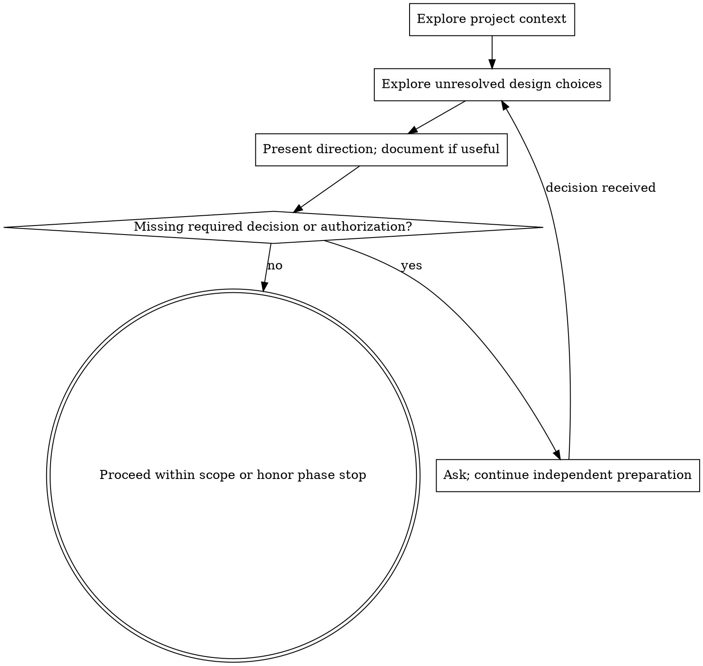

# Brainstorming Ideas Into Designs

Help turn ideas into fully formed designs and specs through natural collaborative dialogue.

Start by understanding the current project context, then resolve the decisions that materially affect the result. Present the proposed direction and trade-offs at a level appropriate to the task.

## Scope and Authorization

Use this workflow when exploration will resolve a meaningful uncertainty, not for every creative task, config change, or simple utility. Reuse explicit choices and valid authorization from the conversation; do not ask the user to approve the same direction again.

If a missing user decision determines the outcome and cannot reasonably be inferred, ask before doing dependent work and continue independent preparation. Honor an explicit design-only phase stop. A design or plan does not authorize publishing, sending messages, deployment, destructive changes, or other actions outside the user's authorized scope; obtain any required authorization at the action boundary.

## Checklist

Adapt these steps to the unresolved decisions; do not create a separate task or approval checkpoint for every item:

1. **Explore project context** — check relevant files, docs, notes, examples, constraints, or recent decisions
2. **Use visuals if helpful** — see the Visual Companion section below
3. **Ask necessary clarifying questions** — understand unresolved purpose/constraints/success criteria
4. **Compare plausible approaches** — with trade-offs and your recommendation when alternatives matter
5. **Present design** — scale detail to complexity and surface any decisions that still require user input
6. **Write design note if useful** — follow the project's document location and naming conventions
7. **Spec self-review** — quick inline check for placeholders, contradictions, ambiguity, scope (see below)
8. **Resolve remaining decisions** — request review only when needed or explicitly required by the user or project
9. **Transition to the next step** — continue within the authorized scope; stop at any explicit phase boundary

## Process Flow

**The outcome is a clear direction and any remaining decision boundaries.** Use `writing-plans` when a detailed implementation plan adds value and the skill is available. Otherwise continue directly within the user's authorized scope.

## The Process

**Understanding the idea:**

- Check out the current project state first (files, docs, notes, examples, recent decisions)
- Before asking detailed questions, assess scope: if the request describes multiple independent subsystems (e.g., "build a platform with chat, file storage, billing, and analytics"), flag this immediately. Don't spend questions refining details of a project that needs to be decomposed first.
- If the project is too large for a single design, help the user decompose it: what are the independent pieces, how do they relate, what order should they happen in? Then brainstorm the first piece through the normal design flow.
- Ask only questions whose answers materially affect the design and cannot be inferred from context
- Prefer multiple choice questions when possible, but open-ended is fine too
- Keep questions focused; bundle closely related questions when that reduces back-and-forth
- Focus on understanding: purpose, constraints, success criteria

**Exploring approaches:**

- Compare 2-3 plausible approaches when there are meaningful alternatives; do not invent alternatives for a settled choice
- Present options conversationally with your recommendation and reasoning
- Lead with your recommended option and explain why

**Presenting the design:**

- Once you believe you understand what you're building, present the design
- Scale each section to its complexity: a few sentences if straightforward, up to 200-300 words if nuanced
- Ask for input on unresolved consequential choices, not approval after every section
- Cover the relevant dimensions: structure, components or sections, inputs and outputs, risks, decision points, review method, and validation
- Be ready to go back and clarify if something doesn't make sense

**Design for isolation and clarity:**

- Break the system into smaller units that each have one clear purpose, communicate through well-defined interfaces, and can be understood and tested independently
- For each unit, you should be able to answer: what does it do, how do you use it, and what does it depend on?
- Can someone understand what a unit does without reading its internals? Can you change the internals without breaking consumers? If not, the boundaries need work.
- Smaller, well-bounded units are also easier to work with. You reason better about artifacts you can hold in context at once, and your edits are more reliable when each artifact or section has a clear job.

**Working in existing projects:**

- Explore the current structure before proposing changes. Follow existing patterns.
- Where existing material has problems that affect the work (e.g., unclear boundaries, tangled responsibilities, outdated notes, confusing structure), include targeted improvements as part of the design.
- Don't propose unrelated cleanup. Stay focused on what serves the current goal.

## After the Design

**Documentation:**

- Write a design note when the complexity or requested deliverable warrants one; follow existing project conventions and user preferences
- Use elements-of-style:writing-clearly-and-concisely skill if available
- Commit only if this is git-tracked work and the user or repo workflow expects commits

**Spec Self-Review:**
After writing the spec document, look at it with fresh eyes:

1. **Placeholder scan:** Any "TBD", "TODO", incomplete sections, or vague requirements? Fix them.
2. **Internal consistency:** Do any sections contradict each other? Does the structure match the requested outcome?
3. **Scope check:** Is this focused enough for a single next step, or does it need decomposition?
4. **Ambiguity check:** Could any requirement be interpreted two different ways? If so, pick one and make it explicit.

Fix any issues inline. No need to re-review — just fix and move on.

**Review and Remaining Decisions:**
Share the design note when one was written. Ask for review when the user requested a design review, the project requires it, or an unresolved decision blocks dependent work. Otherwise continue the authorized task without adding a written-spec approval gate. Incorporate requested changes and check their effect on scope and consistency.

**Next Step:**

- Use `writing-plans` when a detailed execution plan is useful and the skill is available.
- For clear, authorized work, proceed directly.
- For research or writing, continue with the approved direction and validation method.

## Key Principles

- **Focused questions** - Resolve material uncertainty without unnecessary back-and-forth
- **Multiple choice preferred** - Easier to answer than open-ended when possible
- **YAGNI ruthlessly** - Remove unnecessary extras from all designs
- **Explore alternatives** - Compare options when they affect the outcome
- **Proportional validation** - Reuse existing decisions and request input only where needed
- **Be flexible** - Go back and clarify when something doesn't make sense

## Visual Companion

A browser-based companion for showing mockups, diagrams, and visual options during brainstorming. Available as a tool — not a mode. Accepting the companion means it's available for questions that benefit from visual treatment; it does NOT mean every question goes through the browser.

**Choosing visuals:** Use an available inline visualization or a simple diagram when it helps resolve a design choice. The optional browser companion is useful for interactive mockups; check its setup requirements and the user's preferences before launching it. Do not make visual setup a prerequisite for unrelated design work.

**Per-question decision:** Decide whether the user would understand this better by seeing it than reading it.

- **Use the browser** for content that IS visual — mockups, wireframes, layout comparisons, architecture diagrams, side-by-side visual designs
- **Use the terminal** for content that is text — requirements questions, conceptual choices, tradeoff lists, A/B/C/D text options, scope decisions

A question about a UI topic is not automatically a visual question. "What does personality mean in this context?" is a conceptual question — use the terminal. "Which wizard layout works better?" is a visual question — use the browser.

If using the browser companion, read its setup and consent instructions before launching it:
`./visual-companion.md`
